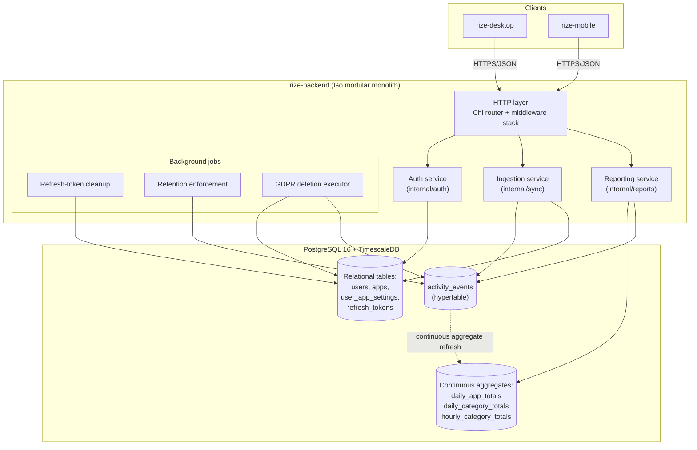
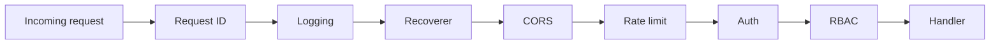
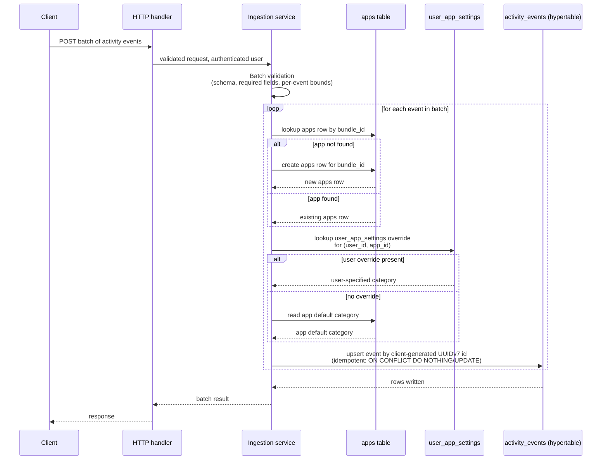

# Backend Architecture

## Overview

`rize-backend` is the single service that both clients — described in [[architecture-desktop]] and [[architecture-mobile]] — upload activity to, and the only place where cross-device aggregation happens, per the server-authoritative aggregation decision in [[system-overview]]. It is written in Go 1.23+, exposes an HTTPS/JSON API over Chi (see [[api-reference]]), and persists everything in PostgreSQL 16 with the TimescaleDB extension, accessed through sqlc-generated queries over pgx. Authentication tokens are issued and verified with golang-jwt, per [[security]]. This document covers how the backend is shaped internally: the module layout, the request-handling pipeline, the ingestion path that turns client uploads into rows in the `activity_events` hypertable (schema in [[database-schema]]), the aggregation strategy used to build reports, and the operational concerns (config, observability, migrations, local dev).

## Service Shape: Modular Monolith, Not Microservices

The backend is built as a single Go modular monolith: one deployable binary, one PostgreSQL/TimescaleDB database, with internal module boundaries enforced by Go package structure rather than by network calls between services.

This is a deliberate choice against a microservices decomposition at this stage, for three reasons:

- **Transactional consistency.** Ingestion, category resolution, and aggregation frequently need to reason about the same rows (for example, resolving an app catalog entry and then writing the event that references it) in ways that are simplest to guarantee inside a single database transaction. Splitting these across services would trade that consistency for distributed-transaction complexity with no corresponding benefit yet.
- **Operational cost for a small team.** A single deployable means one build, one deployment pipeline, and one runtime to operate, monitor, and reason about. Microservices multiply these costs (service discovery, inter-service auth, distributed tracing, versioned contracts between services) at a stage where the team is not large enough to own that overhead.
- **Module boundaries preserve the option to extract later.** Because the internal layout already separates `auth`, `sync` (ingestion), `reports` (aggregation/reporting), and `store` (data access) into distinct packages with narrow interfaces between them, any of these can be pulled out into its own service later if its scaling or team-ownership needs diverge from the rest of the monolith. The monolith is a starting shape, not a permanent constraint.

### Layering

Within the monolith, requests flow through a strict layering:

```
handlers -> services -> repositories -> PostgreSQL
```

- **Handlers** parse and validate HTTP requests, translate them to service calls, and shape HTTP responses. They hold no business logic.
- **Services** hold business logic: auth flows, ingestion validation and resolution, report computation. Services are the only layer allowed to coordinate across multiple repositories or enforce cross-cutting invariants.
- **Repositories** are the sqlc/pgx-generated (or thinly wrapped) data-access layer. They know how to read and write rows; they do not know why.
- **PostgreSQL** (with TimescaleDB) is the single datastore for both transactional and time-series data, per the tech-stack decision in [[system-overview]].

### Package Layout

```
cmd/api            - main package: process entrypoint, wiring, server startup
internal/auth       - authentication and RBAC: token issuance/verification, Sign in with Apple exchange
internal/sync       - ingestion service: batch validation, app/category resolution, idempotent upsert
internal/reports    - reporting/aggregation service: queries over continuous aggregates
internal/store      - repository layer: sqlc-generated queries, pgx pool, migrations glue
internal/middleware - the shared middleware stack (see below)
```

`cmd/api` depends on all `internal/*` packages to wire them together; the `internal/*` packages depend on `internal/store` for persistence but not on each other except where a service explicitly calls another (for example, `sync` resolving an authenticated user via `auth`).

## Component Diagram

The diagram below shows the backend's internal components and how they relate to the datastore and to background processing. It elaborates the single "Backend API (Go)" and "PostgreSQL + TimescaleDB" nodes from the system context diagram in [[system-overview]].



Notes on the diagram:

- The **Ingestion service** is the only writer of the `activity_events` hypertable; it also reads and writes `apps` and `user_app_settings` during app/category resolution (see the ingestion pipeline below).
- The **Reporting service** reads from the continuous aggregates for historical periods and from the raw hypertable for the current, not-yet-aggregated period (see the aggregation strategy section).
- **Background jobs** run inside the same binary as scheduled goroutines rather than as separate services, consistent with the modular-monolith shape: refresh-token cleanup removes expired/revoked tokens from `refresh_tokens`, retention enforcement drops or compresses old hypertable chunks, and the GDPR deletion executor removes a user's data across both relational tables and the hypertable on request.

## Middleware Stack

Every request passes through the following middleware, in this exact order, wired in `internal/middleware` and applied in `cmd/api`:



1. **Request ID** — assigns a unique ID to the request, attached to the context so downstream logs and error responses can be correlated.
2. **Logging** — structured, per-request access logging (method, path, status, latency, request ID).
3. **Recoverer** — recovers from panics in downstream handlers, converting them into a 500 response instead of crashing the process.
4. **CORS** — applies cross-origin policy for browser-originated requests.
5. **Rate limit** — throttles request volume before any auth or business logic runs, to protect the service from abusive or runaway clients.
6. **Auth** — verifies the JWT (per [[security]]) and attaches the authenticated user to the request context; rejects unauthenticated requests to protected routes.
7. **RBAC** — authorizes the now-known, authenticated user against the requested route/resource, rejecting requests that are authenticated but not authorized.

The ordering is deliberate: request ID and logging must wrap everything so every request (including failures) is traceable; the recoverer must sit outside all business-logic-adjacent middleware so a panic anywhere downstream is still caught; CORS and rate limiting are applied before any per-user work (auth, RBAC) so unauthenticated/abusive traffic is rejected as cheaply as possible; and RBAC only makes sense after auth has established who the caller is.

> [!note] Open question
> The brief specifies the rate-limit middleware's position in the stack but not its scope or thresholds (per-IP vs. per-token, request budget, window). This should be resolved alongside [[security]] and [[api-reference]].

## Ingestion Pipeline

Activity uploaded by either client — automatic app/window events from desktop, Screen Time-derived and manual-session events from mobile, per [[architecture-desktop]] and [[architecture-mobile]] — arrives at the Ingestion service (`internal/sync`) as a batch, consistent with the client-generated UUIDv7 idempotency and offline-first sync design in [[sync-protocol]]. Each batch goes through four stages before anything is committed:



Stage detail:

1. **Batch validation.** The incoming batch is validated as a whole (well-formed payload, required fields present, per-event value bounds) before any database work happens, so a malformed batch is rejected cheaply and atomically rather than partially processed.
2. **App catalog resolution.** For each event, the service resolves the event's `bundle_id` to a row in the `apps` table. If no matching row exists, one is created automatically — the app catalog grows organically as new bundle IDs are observed, rather than requiring a pre-seeded catalog.
3. **Category resolution.** The event's category is resolved with a two-step fallback: first, a user-specific override in `user_app_settings` for that `(user, app)` pair; if none exists, the app's default category from the `apps` row resolved in the previous step.
4. **Idempotent upsert.** The event is written into the `activity_events` hypertable keyed by its client-generated UUIDv7 id (see the idempotency decision in [[system-overview]]), so retried or replayed uploads from an offline-first client do not create duplicate rows. This is consistent with the append-only, immutable treatment of activity events described in [[system-overview]] — the upsert is for deduplication of retries, not for editing already-committed events.

Schema for `apps`, `user_app_settings`, and `activity_events` is defined in [[database-schema]]; the batch request/response contract is defined in [[api-reference]] and [[sync-protocol]].

## Aggregation Strategy

Reporting is built on TimescaleDB continuous aggregates rather than hand-rolled rollup jobs (cron-triggered batch jobs that recompute summary tables). Three continuous aggregates back the reporting service:

- `daily_app_totals` — per-user, per-app time totals by day.
- `daily_category_totals` — per-user, per-category time totals by day.
- `hourly_category_totals` — per-user, per-category time totals by hour, for finer-grained intraday views.

TimescaleDB refreshes these aggregates incrementally as new chunks of `activity_events` are written, rather than the backend having to schedule, coordinate, and backfill its own rollup jobs. This removes an entire class of custom scheduling and consistency logic from `internal/reports` — the reporting service queries the aggregates directly for closed historical periods.

Because a continuous aggregate's refresh policy does not guarantee up-to-the-second freshness for the current, still-accumulating period, the reporting service covers "today" (or the current partial hour, for `hourly_category_totals`) by combining the aggregate's data for completed periods with a real-time aggregation query over the raw `activity_events` hypertable for the partial period. This gives users an up-to-date view of the current day without waiting on the aggregate's refresh interval.

## Config & Observability

- **Configuration** is environment-based: the process reads its configuration (database connection, JWT signing material, rate-limit parameters, etc.) from environment variables at startup, with no separate config-file format to keep in sync across environments.
- **Logging** is structured (machine-parsable, key-value/JSON-style) rather than free-text, so logs can be correlated by request ID (from the request-ID middleware) and consumed by log aggregation tooling.
- **Health endpoints**: `/healthz` reports basic liveness (the process is up and able to respond), and `/readyz` reports readiness (the process's dependencies — notably the database connection pool — are available and it can serve traffic).
- **Metrics**: Prometheus-format metrics are exposed at `/metrics`, covering standard HTTP metrics (request counts, latencies, status codes) as well as service-specific counters (ingestion batch sizes, aggregate query latency, background job run outcomes).

### Migration Policy

Schema migrations are managed with golang-migrate and are forward-only: every schema change is expressed as a new, additive migration file, and existing migrations are never edited or rolled back in place once applied to a shared environment. This matches the append-only philosophy applied elsewhere in the system (see the append-only activity events decision in [[system-overview]]) and keeps the migration history a reliable, replayable audit trail across environments.

> [!note] Open question
> The brief does not specify how a forward-only migration policy handles a mistake in an already-applied migration (a corrective forward migration is the natural approach, but this is not stated explicitly). Worth confirming alongside [[database-schema]].

## Local Development

Local development runs the backend and its datastore via `docker-compose`, using a TimescaleDB image (a PostgreSQL image with the TimescaleDB extension preinstalled) for the database service, so that continuous aggregates and hypertables behave the same locally as in deployed environments. The Go binary itself can be run directly against the compose-managed database using the same environment-based configuration described above.

> [!note] Open question
> The brief does not specify whether the background jobs (refresh-token cleanup, retention enforcement, GDPR deletion executor) run on a fixed schedule, and if so at what interval, or what retention window the retention-enforcement job targets. Worth confirming alongside [[security]] and [[database-schema]].

## Related

- [[system-overview]]
- [[architecture-desktop]]
- [[architecture-mobile]]
- [[sync-protocol]]
- [[api-reference]]
- [[database-schema]]
- [[security]]
