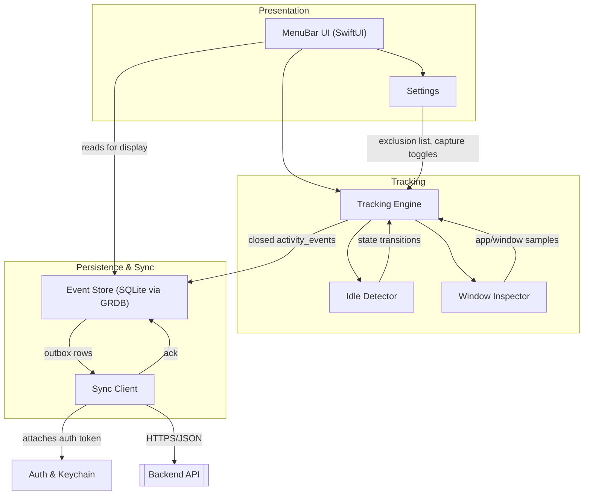
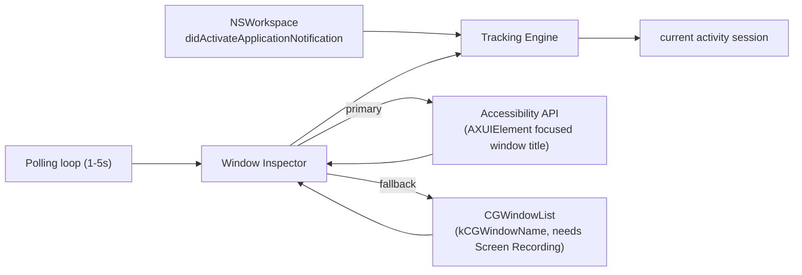
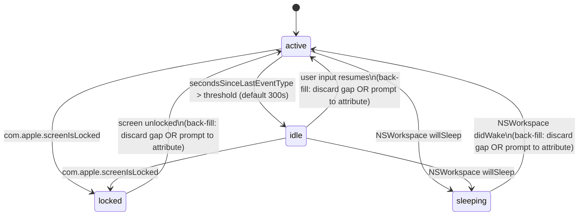
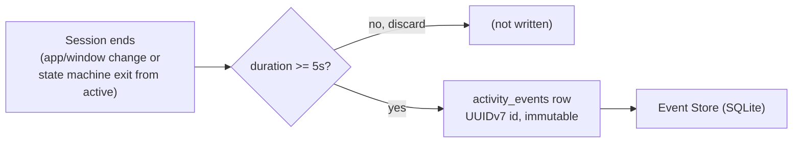
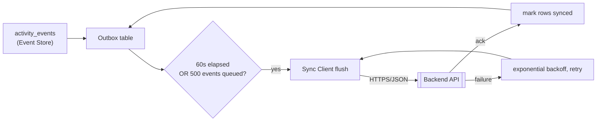

# Architecture: Desktop

The desktop client (`rize-desktop`) is a macOS menu-bar application that automatically tracks application and window-level activity in the background, buffers it in a local offline-first store, and syncs it to the backend. This document describes its internal component structure, the tracking pipeline and state machine, the event model, the sync loop, the permissions it requires, and its in-client privacy controls. It complements the client/tech-stack summary in [[system-overview]].

## Component Diagram

The client is organized around a background tracking engine that feeds an offline-first event store, decoupled from the SwiftUI-based menu-bar UI. Auth, Keychain-backed token storage, and user-configurable Settings sit alongside the tracking path and influence its behavior (for example, exclusion lists and capture toggles configured in Settings gate what the Tracking Engine records).

Responsibilities:

- **MenuBar UI (SwiftUI)** — the always-available presentation surface hosted by the `NSStatusItem` menu-bar shell (see [[system-overview]] for why `NSStatusItem` rather than `MenuBarExtra` was chosen); renders current tracking state and recent activity read from the Event Store.
- **Tracking Engine** — orchestrates the frontmost-app and window-title capture pipeline described below, drives the tracking state machine, and closes finished activity sessions into `activity_events`.
- **Idle Detector** — determines `active`/`idle`/`locked`/`sleeping` state using system idle time and system notifications; see the state machine below.
- **Window Inspector** — resolves the focused window's title via the Accessibility API or CGWindowList fallback.
- **Event Store (SQLite via GRDB)** — the offline-first local database holding immutable `activity_events` and the sync outbox.
- **Sync Client** — flushes the outbox to the backend on the schedule and backoff policy described below.
- **Auth & Keychain** — holds the authenticated session/token material used by the Sync Client, stored in the macOS Keychain.
- **Settings** — user-configurable exclusion list, window-title capture toggle, and private/incognito filtering, consumed by the Tracking Engine.

## Tracking Pipeline

The Tracking Engine combines an event-driven signal for application switches with a polling loop for window-title changes within the same application:

- **Frontmost application changes** are detected via `NSWorkspace`'s `didActivateApplicationNotification`. This fires whenever the user switches to a different application and gives the Tracking Engine the new frontmost app's identity without polling.
- **Focused window title** is not covered by that notification (the user can switch windows within the same app without an app-activation event), so a **polling loop running every 1-5 seconds** re-reads the focused window's title.
  - The **primary path** for reading the window title is the **Accessibility API**, querying the focused `AXUIElement`'s window title.
  - **CGWindowList** (`kCGWindowName`) is the **fallback path**, used when the Accessibility path is unavailable; it requires the Screen Recording permission (see the permissions table below).
- **Browser URL capture** via AppleScript or the Accessibility API is called out explicitly as a **later enhancement**, not part of the current pipeline.

> [!note] Open question
> The brief does not specify the exact polling interval within the 1-5 second range, whether it is fixed or adaptive, or the precise fallback trigger condition (permission denial vs. API failure vs. both). Documented here as a bounded range per the brief; see also the Screen Recording row in the permissions table for the related graceful-degradation behavior.

## Tracking State Machine

The Tracking Engine's activity state determines whether frontmost-app/window samples are attributed to a live session or excluded from tracking. Transitions:

- `active -> idle` when `CGEventSource`'s `secondsSinceLastEventType` exceeds a threshold, default **300 seconds**.
- `-> locked` on the `com.apple.screenIsLocked` distributed notification (reachable from any state in which the screen can lock).
- `-> sleeping` on `NSWorkspace` `willSleepNotification` / `didWakeNotification` (`willSleep` drives the transition into `sleeping`; `didWake` drives the return transition).
- Returning from `idle` (or from `locked`/`sleeping`) to `active` triggers the **back-fill decision** for the elapsed gap: either **discard the idle gap** (the gap is not attributed to any activity), or **prompt the user to attribute it** (the user assigns the gap to a task/session retroactively). Both back-fill rules are given by the brief as the defined options for handling the gap.

> [!note] Open question
> The brief presents "discard the idle gap" and "prompt the user to attribute it" as the two back-fill rules without specifying which is the default or whether the choice is user-configurable per Settings. Recommend resolving this alongside the exclusion-list/capture-toggle settings in the Privacy Controls section below.

## Event Model

When a tracked session ends (on an app/window change, or on a state-machine transition out of `active`), the Tracking Engine closes it into an immutable row in `activity_events`:

- Each row is assigned a **client-generated UUIDv7** as its identifier. UUIDv7's time-ordered structure supports both idempotent ingestion on the backend and natural sort order locally (consistent with the client-generated-identifier decision in [[system-overview]]).
- A **minimum-duration filter** discards sessions shorter than **5 seconds** — these are treated as noise (e.g., transient window focus flicker) and never written to `activity_events`.
- `activity_events` rows are **immutable** once written: corrections are made by appending new events, not by editing existing rows, matching the append-only event model described in [[system-overview]].
- The local `activity_events` schema **mirrors the server ingest contract**; the authoritative shape of these rows is defined in [[database-schema]], and the local GRDB schema must be kept in sync with it.

## Offline-First Store & Sync Loop

The Event Store is offline-first: `activity_events` are always written locally first, independent of network state, and a **SQLite outbox table** tracks which rows still need to reach the backend.

- The **Sync Client** flushes the outbox **every 60 seconds**, or immediately once **500 events** have accumulated in the outbox, whichever comes first.
- On flush failure, the Sync Client applies **exponential backoff** before retrying.
- A row is marked **synced only after the server acknowledges** receipt of that row — there is no optimistic local marking of sync completion.
- The wire format, batching, idempotency (via the UUIDv7 identifiers from the Event Model above), and acknowledgment semantics of this flush are specified in [[sync-protocol]].

## Permissions & Entitlements

| Permission / entitlement | Purpose | Notes |
|---|---|---|
| Accessibility (`AXIsProcessTrusted`) | Primary path for reading the focused window's title via `AXUIElement`. | Onboarding includes a deep-link into System Settings to guide the user through granting this permission. |
| Screen Recording | Required only if window titles via the `CGWindowList` fallback are enabled. | If denied, the client degrades gracefully to **app-name-only tracking** — the fallback path is simply unavailable and no window-title data is captured for apps where the Accessibility path also fails. |
| Login Item via `SMAppService` | Launches the app automatically at login so tracking starts without manual intervention. | — |
| Hardened Runtime + Notarization | Required for Developer ID-signed distribution to run without Gatekeeper warnings. | — |
| App Sandbox | **Not used.** | The Accessibility API is incompatible with the App Sandbox, so sandboxing is explicitly not applied; this is also why distribution is **Developer ID**, not the **Mac App Store** (consistent with the tech-stack rationale in [[system-overview]]). |

> [!note] Open question
> The brief does not specify the exact onboarding UX for the Accessibility deep-link (e.g., whether it re-checks `AXIsProcessTrusted` on a polling basis or relies on the app relaunching/foregrounding), nor whether Screen Recording is requested proactively or only when the user enables window-title capture in Settings.

## Privacy Controls

The client exposes user-facing controls in Settings that constrain what the Tracking Engine captures and stores, independent of the OS-level permissions above:

- **Per-app exclusion list** — apps on this list are excluded from tracking entirely; no `activity_events` rows are produced for them.
- **Window-title capture toggle** — lets the user disable window-title capture globally, in which case only app-level (not window-level) activity is recorded, regardless of whether the Accessibility or CGWindowList path would otherwise be available.
- **Private/incognito window filtering** — filters out window titles/activity associated with private or incognito browser windows.

These client-side controls are the desktop app's part of the broader privacy and security model; see [[security]] for the corresponding backend-side and cross-client requirements.

## Related

- [[system-overview]]
- [[architecture-mobile]]
- [[architecture-backend]]
- [[sync-protocol]]
- [[database-schema]]
- [[security]]
