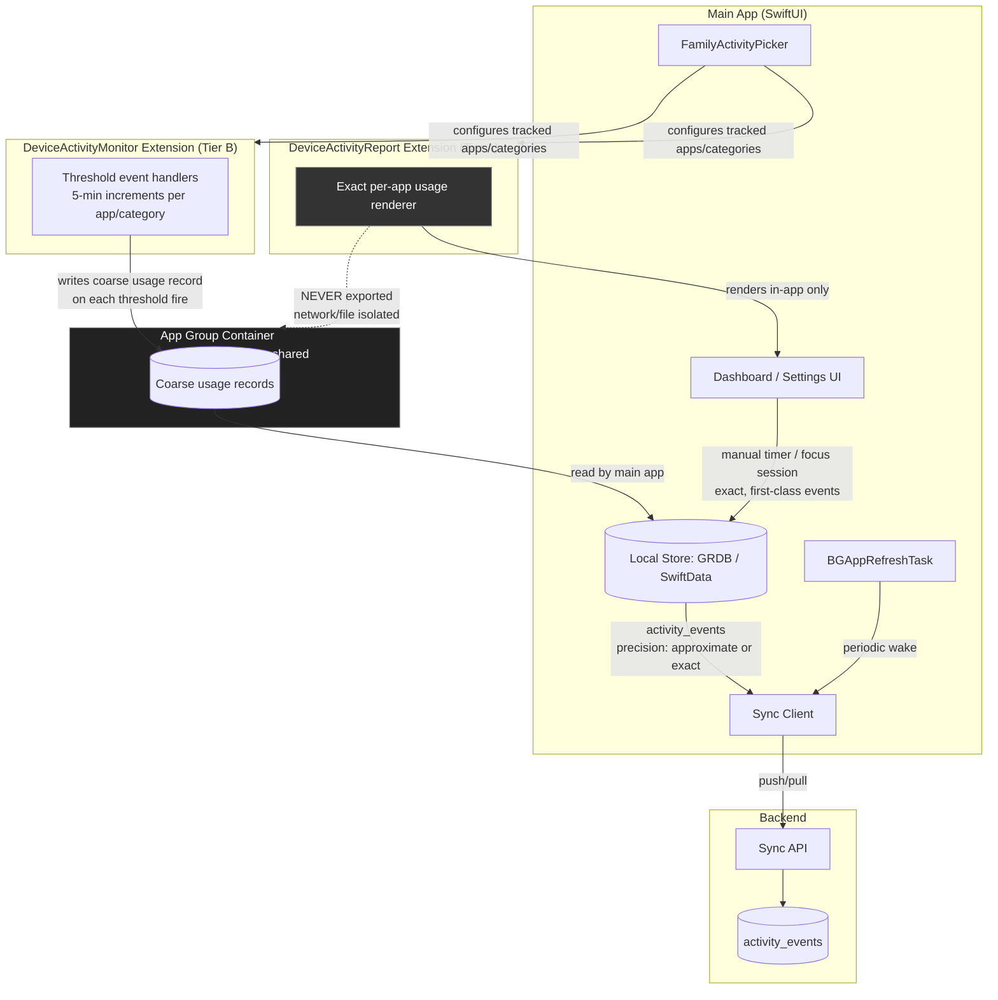

# Mobile Architecture

This document describes the iOS client architecture for Rize-Clone, focusing on how the app reconciles Apple's Screen Time privacy model with the product's need to track, display, and sync usage data. For the equivalent desktop design, see [[architecture-desktop]]. For how mobile data ultimately lands on the server, see [[architecture-backend]] and [[sync-protocol]].

## 1. The Apple Constraint

The mobile client's entire architecture is downstream of a single OS-level restriction: **exact, per-app Screen Time usage data can only be read inside a `DeviceActivityReport` extension**, and that extension is deliberately network- and file-isolated by iOS.

Concretely:

- The `DeviceActivityReport` extension can render exact per-app and per-category usage as a SwiftUI view that gets composited into the host app's UI.
- That extension has no network access and no shared-file access beyond what the OS explicitly allows for rendering. It cannot call out to a sync client, write to the App Group container, or otherwise export the exact numbers it computes.
- The result: exact usage data can be **displayed**, but it can never be **exported, persisted outside the extension, or synced** to the backend.

This is not a bug to work around — it is a hard boundary enforced by the OS sandbox, and it forces Rize-Clone's mobile client into a three-tier hybrid model rather than the single-source-of-truth model used on desktop (see [[architecture-desktop]]).

> [!note] Open question
> The brief does not specify whether an Android counterpart to this architecture exists or is planned. Screen Time / `DeviceActivityReport` / `FamilyControls` are iOS-only APIs; if `rize-mobile` also targets Android, that platform will need an entirely separate data-source strategy (e.g. `UsageStatsManager`) and is out of scope for this document until clarified.

## 2. Three-Tier Hybrid Model

Because exact data cannot leave the `DeviceActivityReport` extension, Rize-Clone mobile blends three independent data tiers, each with a different accuracy/sync trade-off:

| Tier | Source | Accuracy | Leaves the device? |
|------|--------|----------|---------------------|
| A | `DeviceActivityReport` extension | Exact | No — display-only |
| B | `DeviceActivityMonitor` extension (threshold events) | Approximate (±5 min) | Yes — synced |
| C | Manual timers / focus sessions | Exact | Yes — synced |

### Tier A — Exact, display-only

The `DeviceActivityReport` extension is given a `DeviceActivityFilter` scoped to the user's selected apps/categories (chosen via `FamilyActivityPicker`) and renders exact usage figures directly into a SwiftUI view embedded in the main app's dashboard. This is the most accurate data the app ever shows the user, but architecturally it is a dead end: nothing computed inside this extension can be written to `group.com.rizeclone.shared`, sent over the network, or otherwise persisted for sync. It exists purely to give the user an accurate in-the-moment picture.

### Tier B — Approximate, synced

The `DeviceActivityMonitor` extension is configured with a `DeviceActivitySchedule` and `DeviceActivityEvent` thresholds for each tracked app/category. Each threshold fires at 5-minute increments of usage — i.e., the monitor extension receives a callback every time a tracked app crosses another 5 minutes of cumulative use for the day. On each threshold callback, the extension writes a coarse usage record into the App Group container `group.com.rizeclone.shared`. The main app later reads these records, converts them into the shared `activity_events` model with `precision: approximate`, and hands them to the Sync Client for upload. See [[database-schema]] for the `activity_events` shape and [[sync-protocol]] for how precision-tagged events are reconciled server-side.

### Tier C — Exact, synced

Manual timers and focus sessions are first-class features of the app, not a fallback for Tier B's imprecision. They are started and stopped explicitly by the user inside the main app, so their durations are exact by construction. These events sync fully and behave like desktop-originated events (see [[architecture-desktop]]) — no precision caveat is needed for Tier C data.

#### Tier C pause semantics (MVP): wall-clock is authoritative

A focus/manual session can be paused and resumed by the user while it is running, but this resolved decision (made during the RIZ-44 review; implemented in `rize-mobile` PR #4) fixes how pausing interacts with the persisted and synced record for the MVP:

- The session's persisted and synced record carries only real instants — `started_at` at start and `ended_at` at stop — matching the [[database-schema]] `focus_sessions` shape. The recorded duration is therefore the wall-clock span **including** any paused time.
- Pause/resume state is client-only view state. It never syncs, and the schema has no pause representation — there is no column or field anywhere in the synced record that encodes "paused" or accumulates paused duration.
- The running-session UI shows the wall-clock span (`ended_at - started_at`, or "now - started_at" while running) as the **primary** timer. Active-time-excluding-pauses is shown as a **secondary** figure, with copy stating explicitly that the recorded time includes pauses.

The rationale is that excluding paused time from the recorded duration would require a `focus_sessions` schema/contract change — for example, a `paused_total_s` column that both `rize-mobile` and the backend would need to write, sync, and reconcile through [[sync-protocol]]. That change is deferred post-MVP.

> [!note] Follow-up
> Excluding paused time from recorded `focus_sessions` duration is deferred post-MVP. It will require a `focus_sessions` schema/contract change (e.g. a `paused_total_s` column) in [[database-schema]] and corresponding handling in [[sync-protocol]]. This is a planned follow-up, not an open question — the MVP decision (wall-clock authoritative, pause state client-only) is final.

## 3. Threshold-Event Strategy

The Tier B pipeline is the most operationally delicate part of the mobile architecture, since it is the only synced source of per-app breakdown data and it depends on an OS extension the app does not fully control.

- **Schedule**: one `DeviceActivitySchedule` is configured per day, spanning midnight to midnight (or the OS-supported equivalent), so the monitor extension has a full day of coverage per schedule instance.
- **Thresholds**: a `DeviceActivityEvent` threshold is registered at 5-minute increments for each tracked app and category. This means a heavily used app can fire many threshold callbacks over the course of a day.
- **System limits**: iOS imposes a system-wide limit on the number of threshold events that can be registered per schedule/monitor. This constrains how many apps/categories can be tracked at 5-minute granularity simultaneously.

  > [!note] Open question
  > The brief calls out that system limits on the number of thresholds must be documented, but does not give the exact cap. Apple does not publish a fixed numeric limit for `DeviceActivityEvent` thresholds per schedule; this needs to be empirically verified against the target iOS SDK version and recorded here before the tracked-app limit is surfaced in `FamilyActivityPicker` UI copy.

- **Accuracy expectation**: because events only fire on 5-minute boundaries, all Tier B data carries an inherent ±5 minute granularity. This is the source of the "approximate" precision tag and must be communicated to the user (see Section 6).
- **Day-boundary restart**: when the daily `DeviceActivitySchedule` ends and a new one begins at midnight, the monitor extension's threshold counters restart. The main app must treat the schedule rollover as a hard boundary when aggregating Tier B records — usage accrued right before midnight and right after must not be merged into a single threshold count, and the local store must reconcile the last partial-day record before starting a new one.
- **Battery considerations**: the `DeviceActivityMonitor` extension is woken by the system only when a registered threshold is crossed, rather than polling continuously, which keeps its incremental battery cost low. The main app's own responsibility is to avoid triggering unnecessary wake-ups when reading the App Group container or invoking sync — this is handled via the `BGAppRefreshTask` batching described in Section 4 rather than by reacting to every individual threshold write in real time.

## 4. Components

- **SwiftUI app** — the main app shell: dashboard (blended Tier A/B/C view), manual timer and focus session controls, and settings (including tracked-app configuration and account/sync settings).
- **`FamilyActivityPicker`** — the standard system UI for letting the user choose which apps and categories are tracked; its selection output configures both the `DeviceActivityReport` extension (Tier A) and the `DeviceActivityMonitor` extension (Tier B).
- **App Group `group.com.rizeclone.shared`** — the shared container that is the only channel through which Tier B data crosses from the monitor extension into the main app. See [[security]] for the entitlement and sandboxing implications of this container.
- **Local store (GRDB or SwiftData)** — persists `activity_events` (Tier B and Tier C) on-device before and after sync; see [[database-schema]] for the canonical event schema shared with the backend.
- **Sync Client** — reads pending local events, pushes them to the backend, and pulls remote state, following the same [[sync-protocol]] used by desktop.

A shared Swift package containing sync/DTO types common to `rize-mobile` and `rize-desktop` is a future goal, so that the wire format and precision semantics (`precision: approximate` vs exact) are defined once and consumed by both clients rather than duplicated. This has not been built yet.

## 5. Entitlements & Approval

Several entitlements gate this architecture, and one of them carries meaningful schedule risk:

- **`com.apple.developer.family-controls`** — required for `FamilyActivityPicker`, `DeviceActivityReport`, and `DeviceActivityMonitor`. It works in development simply by enabling the capability in Xcode/the provisioning profile. **App Store distribution, however, requires separately requesting this entitlement from Apple via their request form, and approval typically takes weeks.** This must be treated as an explicit schedule risk and requested well ahead of any planned App Store submission — it is not something that can be enabled at the last minute the way most capabilities are.
- **App Groups entitlement** — required for `group.com.rizeclone.shared`, the container used by Tier B.
- **Sign in with Apple** — used for account authentication.
- **Background Tasks (`BGAppRefreshTask`)** — used to periodically wake the main app to read Tier B records out of the App Group container and drive the Sync Client without requiring the user to have the app in the foreground.

See [[security]] for how these entitlements interact with the app's overall sandboxing and data-handling posture.

## 6. UX Honesty Requirement

Because Tier B data is fundamentally approximate (±5 minute granularity, see Section 3), the UI has a non-negotiable honesty requirement:

- Any screen displaying Tier B-derived data must visibly label it as **approximate**.
- Any blended report that combines data from more than one tier (e.g., a daily summary that mixes Tier B app breakdowns with Tier C focus-session totals) must show **provenance** — i.e., make clear to the user which numbers came from which tier — rather than presenting a single undifferentiated total.

This requirement exists because Tier A (the only exact per-app source) cannot contribute to any synced or historical report at all; every synced per-app number the user ever sees for past days is, by construction, Tier B and therefore approximate. Silently presenting Tier B numbers as if they had Tier A's precision would misrepresent what the app is technically capable of measuring.

## Related

- [[system-overview]]
- [[architecture-desktop]]
- [[architecture-backend]]
- [[sync-protocol]]
- [[database-schema]]
- [[security]]
- [[api-reference]]
