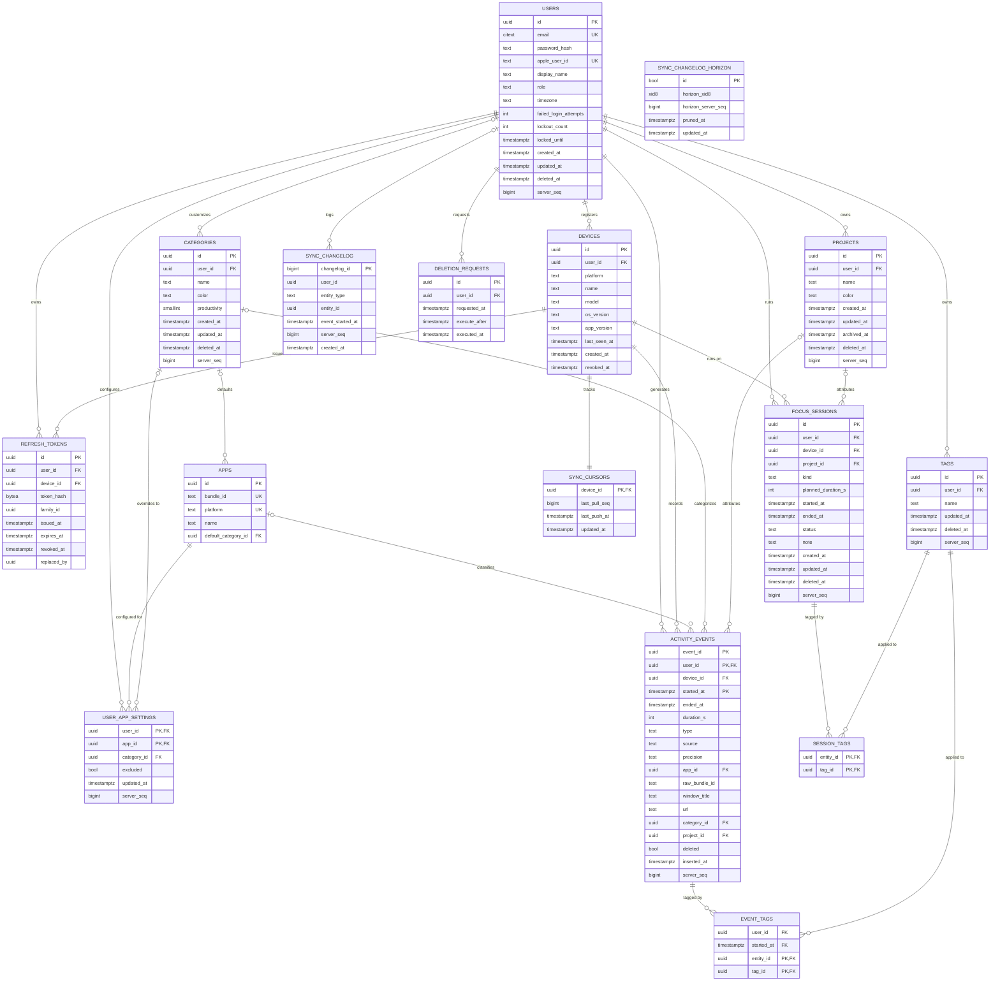

# Database Schema

This document specifies the PostgreSQL + TimescaleDB schema that backs [[architecture-backend]]. It covers every table, its columns, constraints, and indexes; the TimescaleDB hypertable and continuous aggregate design for activity data; and the migration policy used to evolve the schema over time. The wire contract that produces and consumes these rows during client/server sync is defined separately in [[sync-protocol]] and [[api-reference]]; authentication and token lifecycle detail referenced here (`refresh_tokens`, `deletion_requests`) is covered in depth in [[security]].

## Conventions

The schema follows a small set of conventions applied consistently across all tables:

- **Primary keys are UUIDs.** Server-generated rows use Postgres's `gen_random_uuid()`. Rows that originate on a client (activity events, focus sessions, projects, tags) are created with a client-supplied **UUIDv7** instead, so the identifier is both globally unique and time-ordered — this is what lets the backend deduplicate retried or replayed uploads without a round trip to allocate an ID first.
- **All timestamps are `timestamptz`.** Storing the timezone offset alongside every timestamp avoids ambiguity when a user's clients cross timezones or when the backend aggregates across users in different timezones.
- **Soft delete via `deleted_at`.** Tables that support user-initiated deletion carry a nullable `deleted_at` column rather than a hard `DELETE`, so that sync can propagate the tombstone to other devices and so deletions remain reversible until the GDPR grace period in `deletion_requests` expires (see [[security]]).
- **Syncable tables carry `server_seq BIGINT`.** Any table that a client pulls incrementally bumps `server_seq` on every write (insert or update), rather than using offset pagination, so pulls stay correct and efficient regardless of how much data has accumulated. `server_seq` remains the per-row change counter recorded on the entity table itself, but the pull cursor a client actually holds is an opaque, commit-ordered watermark maintained internally by the server over [[#sync_changelog]] (see [[sync-protocol]]) — not a direct `WHERE server_seq > :cursor` scan of each syncable table. The full pull/push mechanics are specified in [[sync-protocol]].

`server_seq` is present on `users` as well as `categories`, but the two are not equivalent: a custom-category edit propagates to other devices through the same pull feed as `user_app_settings`, `projects`, `tags`, `activity_events`, and `focus_sessions` (`categories` has a `sync_changelog` trigger and is part of the pull entity set). `users.server_seq` exists on the table, but `users` is intentionally NOT part of the pull feed at this stage: it has no `sync_changelog` trigger and is not one of the entity types `GET /v1/sync/changes` returns. Profile data (`display_name` and the rest of the `users` row) is instead obtained via the auth endpoints (`GET /v1/users/me`, login/refresh) rather than pull-synced; pull-syncing profile changes across a user's devices is a possible future extension, not a current guarantee.

## Entity-Relationship Diagram

`PK, FK` above marks columns that are simultaneously part of a composite primary key and a foreign key, since Mermaid's ER notation does not have a dedicated combined marker.

## Tables

### users

The root identity table. A user authenticates either with a password (`password_hash`) or with Sign in with Apple (`apple_user_id`); both are nullable because a given account may use only one method.

| Column | Type | Constraints |
|---|---|---|
| id | uuid | PK, default `gen_random_uuid()` |
| email | citext | UNIQUE |
| password_hash | text | NULL |
| apple_user_id | text | UNIQUE, NULL |
| display_name | text | |
| role | text | CHECK (`role IN ('user','admin')`), DEFAULT `'user'` |
| timezone | text | |
| failed_login_attempts | int | brute-force lockout counter, see [[security]] §Account lockout policy |
| lockout_count | int | number of lockouts imposed on this account; drives escalating lockout duration |
| locked_until | timestamptz | NULL; account is locked while `now() < locked_until` |
| created_at | timestamptz | |
| updated_at | timestamptz | |
| deleted_at | timestamptz | NULL |
| server_seq | bigint | bumped on every write |

`citext` on `email` gives case-insensitive uniqueness and lookups without the application having to normalize case itself.

`failed_login_attempts`, `lockout_count`, and `locked_until` (migration 000028) back the brute-force lockout policy specified in [[security]] §Account lockout policy: 10 consecutive failed attempts locks the account for an escalating, capped duration, and both counters reset to zero on the next successful login.

### devices

One row per client installation that has registered with the backend. `revoked_at` lets an admin or the user themselves invalidate a device (and, transitively, its refresh tokens) without deleting the row's history.

| Column | Type | Constraints |
|---|---|---|
| id | uuid | PK, default `gen_random_uuid()` |
| user_id | uuid | FK -> `users(id)` |
| platform | text | CHECK (`platform IN ('macos','ios')`) |
| name | text | |
| model | text | |
| os_version | text | |
| app_version | text | |
| last_seen_at | timestamptz | |
| created_at | timestamptz | |
| revoked_at | timestamptz | NULL |

`id` is the table's primary key and is globally unique across all users, which is a stronger guarantee than — and already subsumes — the per-user uniqueness that [[sync-protocol]]'s `device_id` handling depends on: the contract [[sync-protocol]] relies on is `UNIQUE (user_id, device_id)` semantics, and a globally unique `id` scoped to exactly one `user_id` per row satisfies that contract without a separate composite constraint. Two different users can never end up sharing a row's `id`; the case [[sync-protocol]]'s Duplicate Device IDs edge case actually has to tolerate is the same user's `device_id` being reused across two installations (e.g. a restored backup), which this table's constraints do not detect — see [[sync-protocol#Edge Cases|Duplicate Device IDs]] for how that is handled.

### refresh_tokens

Implements refresh token rotation with reuse detection. Each rotation produces a new token in the same `family_id`; if a revoked or already-rotated token is presented again, the entire family can be revoked, which is the standard defense against a stolen refresh token being replayed after the legitimate client has already rotated past it. Full token-handling rules live in [[security]].

| Column | Type | Constraints |
|---|---|---|
| id | uuid | PK, default `gen_random_uuid()` |
| user_id | uuid | FK -> `users(id)` |
| device_id | uuid | FK -> `devices(id)` |
| token_hash | bytea | |
| family_id | uuid | rotation family, used for reuse detection |
| issued_at | timestamptz | |
| expires_at | timestamptz | |
| revoked_at | timestamptz | NULL |
| replaced_by | uuid | NULL, points to the token that superseded this one |

Indexes: `(user_id)`, `(family_id)`, `(token_hash)`. The `token_hash` index is what makes token validation on every authenticated request a single indexed lookup rather than a table scan; the `family_id` index is what makes "revoke everything in this rotation family" cheap when reuse is detected.

### apps

A global, cross-user catalog of applications, keyed by platform-specific bundle identifier. Rows are auto-populated the first time an app is seen during activity ingestion, so the catalog grows organically rather than being hand-curated up front.

| Column | Type | Constraints |
|---|---|---|
| id | uuid | PK, default `gen_random_uuid()` |
| bundle_id | text | UNIQUE with `platform` |
| platform | text | UNIQUE with `bundle_id` |
| name | text | |
| default_category_id | uuid | FK -> `categories(id)`, NULL |

`UNIQUE (bundle_id, platform)` reflects that the same bundle identifier can in principle mean different apps on different platforms, so uniqueness is scoped per platform rather than globally.

### categories

Categories classify time by productivity value (for example, "Deep Work" vs. "Distraction"). `user_id IS NULL` denotes a system default category available to every user; `user_id` set denotes a user's own custom category.

| Column | Type | Constraints |
|---|---|---|
| id | uuid | PK, default `gen_random_uuid()` |
| user_id | uuid | FK -> `users(id)`, NULL = system default |
| name | text | |
| color | text | |
| productivity | smallint | CHECK (`productivity BETWEEN -2 AND 2`) |
| created_at | timestamptz | |
| updated_at | timestamptz | |
| deleted_at | timestamptz | NULL |
| server_seq | bigint | bumped on every write |

The `productivity` scale (-2 to 2) is what downstream reporting sums to produce a "productive time" metric; it is a fixed five-point scale rather than an open-ended score.

### user_app_settings

Per-user overrides on top of the global `apps` catalog: a user can reassign an app to a different category than its `default_category_id`, or exclude it from tracking/reporting entirely.

| Column | Type | Constraints |
|---|---|---|
| user_id | uuid | PK (composite), FK -> `users(id)` |
| app_id | uuid | PK (composite), FK -> `apps(id)` |
| category_id | uuid | FK -> `categories(id)`, NULL (user override) |
| excluded | bool | DEFAULT `false` |
| updated_at | timestamptz | |
| server_seq | bigint | bumped on every write |

The composite primary key `(user_id, app_id)` enforces at most one settings row per user per app, so "override" is a natural upsert rather than requiring an application-level uniqueness check.

### projects

User-defined containers for attributing time (activity events and focus sessions) to a body of work.

| Column | Type | Constraints |
|---|---|---|
| id | uuid | PK, client-supplied UUIDv7 |
| user_id | uuid | FK -> `users(id)` |
| name | text | |
| color | text | |
| created_at | timestamptz | |
| updated_at | timestamptz | |
| archived_at | timestamptz | NULL |
| deleted_at | timestamptz | NULL |
| server_seq | bigint | bumped on every write |

`archived_at` and `deleted_at` are distinct: archiving hides a project from active selection lists without tombstoning it for sync, whereas `deleted_at` is a full soft delete.

### tags

Free-form labels applicable to both activity events and focus sessions via the join tables below.

| Column | Type | Constraints |
|---|---|---|
| id | uuid | PK, client-supplied UUIDv7 |
| user_id | uuid | FK -> `users(id)` |
| name | text | UNIQUE with `user_id` |
| updated_at | timestamptz | |
| deleted_at | timestamptz | NULL |
| server_seq | bigint | bumped on every write |

`UNIQUE (user_id, name)` prevents a user from creating two tags with the same name, while still letting different users use the same tag name independently.

### activity_events

The append-only, high-volume time-series table capturing every unit of tracked activity from every source (desktop automatic tracking, mobile Screen Time summaries, manual entry). This table is a **TimescaleDB hypertable**, partitioned on `started_at` with a **7-day chunk interval**. See [[architecture-desktop]] and [[architecture-mobile]] for what populates `type`/`source`/`precision` on each platform, and [[sync-protocol]] for how these rows are uploaded and deduplicated.

| Column | Type | Constraints |
|---|---|---|
| event_id | uuid | NOT NULL, client-supplied UUIDv7 |
| user_id | uuid | NOT NULL, FK -> `users(id)` |
| device_id | uuid | NOT NULL, FK -> `devices(id)` |
| started_at | timestamptz | NOT NULL |
| ended_at | timestamptz | NOT NULL |
| duration_s | int | GENERATED ALWAYS AS (`EXTRACT(EPOCH FROM (ended_at - started_at))::int`) STORED |
| type | text | NOT NULL, CHECK (`type IN ('app_active','idle','locked','mobile_usage','manual')`) |
| source | text | NOT NULL, CHECK (`source IN ('desktop','mobile','manual')`) |
| precision | text | NOT NULL, CHECK (`precision IN ('exact','approximate')`), DEFAULT `'exact'` |
| app_id | uuid | FK -> `apps(id)`, NULL |
| raw_bundle_id | text | NULL |
| window_title | text | NULL |
| url | text | NULL |
| category_id | uuid | FK -> `categories(id)`, NULL |
| project_id | uuid | FK -> `projects(id)`, NULL |
| deleted | bool | NOT NULL, DEFAULT `false` |
| inserted_at | timestamptz | NOT NULL |
| server_seq | bigint | NOT NULL, bumped on every write |

`type` and `source` are `NOT NULL` at the database level even though the wire protocol treats `type` as optional (see [[sync-protocol]] §Push): the sync-push service layer defaults an omitted `type` to `"manual"` before the insert, and derives `source` server-side from the authenticated device's `platform` column, so no request payload can produce a null value for either column.

Primary key: `(user_id, started_at, event_id)`. TimescaleDB requires the partitioning column (`started_at`) to be part of any primary key or unique constraint on a hypertable, which is why the PK is composite rather than `event_id` alone — see the Hypertable Notes section below for the full rationale.

Idempotency constraint: `UNIQUE (user_id, event_id, started_at)`. This is what lets an upload retry safely re-submit the same event without creating a duplicate row, complementing the client-generated UUIDv7 `event_id`.

No standalone `UNIQUE (event_id)` constraint exists on this table: TimescaleDB requires every unique constraint on a hypertable to include the partitioning column (`started_at`), so `event_id` alone cannot be made unique. This is why `event_tags` (see below) references the composite primary key rather than a simple `event_id` foreign key.

Indexes:

- `(user_id, started_at DESC)` — the primary access pattern for "this user's activity, most recent first," used by timeline and report views.
- `(user_id, app_id, started_at)` — supports per-app time breakdowns for a user over a range.
- `(user_id, server_seq)` — sync pull now paginates the `sync_changelog` outbox table (see [[#sync_changelog]]) rather than this table's own `server_seq` column directly; this index instead serves the per-table list endpoints that page by this table's own, plain `server_seq` cursor.

Compression policy: chunks older than 30 days are compressed. Retention policy: optional/configurable (not a fixed default), so that data lifetime can be tuned per deployment or per user preference rather than being hard-coded.

`deleted` (a boolean flag) coexists with the soft-delete convention used elsewhere; unlike other tables' `deleted_at`, this table uses a plain flag, which is consistent with activity events being append-only and never truly mutated — a "deletion" here is a correction event's flag, not a lifecycle timestamp.

The generation expression for `duration_s` is `EXTRACT(EPOCH FROM (ended_at - started_at))::int`, computed as a stored generated column so it is always consistent with `started_at`/`ended_at` without the application having to compute or maintain it separately.

### focus_sessions

Explicit, user-initiated sessions (a Pomodoro-style focus block, a break, or a meeting), as opposed to the automatically captured rows in `activity_events`.

| Column | Type | Constraints |
|---|---|---|
| id | uuid | PK, client-supplied UUIDv7 |
| user_id | uuid | FK -> `users(id)` |
| device_id | uuid | FK -> `devices(id)` |
| project_id | uuid | FK -> `projects(id)`, NULL |
| kind | text | CHECK (`kind IN ('focus','break','meeting')`) |
| planned_duration_s | int | NULL |
| started_at | timestamptz | |
| ended_at | timestamptz | NULL |
| status | text | CHECK (`status IN ('running','completed','abandoned')`) |
| note | text | |
| created_at | timestamptz | |
| updated_at | timestamptz | |
| deleted_at | timestamptz | NULL |
| server_seq | bigint | bumped on every write |

`ended_at` is nullable and `status` can be `'running'` because a session is created when it starts, not when it finishes; a session that is neither completed nor explicitly abandoned by the time a client checks in is what the sync protocol's reconciliation logic in [[sync-protocol]] resolves.

### event_tags / session_tags

Join tables attaching tags to, respectively, activity events and focus sessions.

#### event_tags

| Column | Type | Constraints |
|---|---|---|
| user_id | uuid | FK (composite, see below) |
| started_at | timestamptz | FK (composite, see below) |
| entity_id | uuid | PK (composite), FK (composite, see below) |
| tag_id | uuid | PK (composite), FK -> `tags(id)` |

Primary key: `(entity_id, tag_id)`. Foreign key: `FOREIGN KEY (user_id, started_at, entity_id) REFERENCES activity_events (user_id, started_at, event_id)`.

#### session_tags

| Column | Type | Constraints |
|---|---|---|
| entity_id | uuid | PK (composite), FK -> `focus_sessions(id)` |
| tag_id | uuid | PK (composite), FK -> `tags(id)` |

Primary key: `(entity_id, tag_id)`.

`session_tags` keeps the simple two-column shape because `focus_sessions` has a plain, non-composite primary key (`id`), so `session_tags.entity_id REFERENCES focus_sessions(id)` is a straightforward single-column foreign key. `event_tags` cannot do the same: `activity_events` is a hypertable partitioned on `started_at`, so TimescaleDB requires every unique constraint on it to include the partitioning column, and no unique key on `event_id` alone exists — only the composite primary key `(user_id, started_at, event_id)` and the composite idempotency constraint `UNIQUE (user_id, event_id, started_at)`. A foreign key must reference a unique key on the target table, so `event_tags` has to carry the matching composite columns (`user_id`, `started_at`) alongside `entity_id` in order to reference `activity_events`'s composite key. The primary key of `event_tags` remains `(entity_id, tag_id)` — the extra `user_id`/`started_at` columns are needed only to satisfy the foreign key, not to identify the row.

### sync_changelog

An append-only, plain heap outbox table: one row per write (insert or update) to any of the six syncable tables (`activity_events`, `focus_sessions`, `projects`, `tags`, `user_app_settings`, `categories`). `GET /v1/sync/changes` paginates this single table rather than each syncable table's own system columns — see [[sync-protocol]] for why the pull cursor is anchored here.

| Column | Type | Constraints |
|---|---|---|
| changelog_id | bigint | PK, `GENERATED ALWAYS AS IDENTITY` |
| user_id | uuid | NULL |
| entity_type | text | NOT NULL |
| entity_id | uuid | NOT NULL |
| event_started_at | timestamptz | NULL |
| server_seq | bigint | NOT NULL |
| created_at | timestamptz | NOT NULL, DEFAULT `now()` |

Index: `(user_id, server_seq)`.

`created_at` (migration 000029, renumbered from 000027 during rebase) is the column the retention job (see [[#Retention and the sync_changelog_horizon table]] below) ages rows out by. Pre-existing rows were backfilled to migration-apply time rather than to their true original write time — a conservative choice that only ever pushes a pre-existing row's eligibility for pruning later than its real age would justify, never earlier.

`changelog_id` is a plain identity column — a tiebreaker for humans reading the table, not part of the pull cursor. `user_id` is `NULL` only for a changelog row logging a system-default category (`categories.user_id IS NULL`, copied verbatim); every other entity type's `user_id` is never `NULL` here since it isn't `NULL` on the entity table itself. `entity_id` holds that entity's own identifier — `event_id` for `activity_events`, `app_id` for `user_app_settings` (whose primary key is the composite `(user_id, app_id)`), `id` for every other entity type. `event_started_at` is populated only for `activity_events` rows: because `activity_events` is a hypertable partitioned on `started_at`, a point lookup back into it needs `started_at` alongside `entity_id` to land on the correct chunk; every other entity type leaves this column `NULL`. `server_seq` is the entity row's own `server_seq_global`-assigned value at the time of the write that produced this changelog row, copied verbatim.

**Triggers.** Six `AFTER INSERT OR UPDATE` triggers — one per syncable table (`activity_events_log_change`, `focus_sessions_log_change`, `projects_log_change`, `tags_log_change`, `user_app_settings_log_change`, `categories_log_change`) — each append exactly one row into `sync_changelog` whenever their table is written. Each trigger fires strictly after the entity table's own `BEFORE INSERT/UPDATE` trigger has already assigned the row's `server_seq`, so the value copied into `sync_changelog` is always that write's real, final `server_seq`. Because the entity table's write and the `sync_changelog` append happen inside the same transaction, the changelog row commits at the exact same instant as the entity write it describes, which is what lets the pull cursor treat `sync_changelog`'s own commit ordering as authoritative for every syncable table, including `activity_events` once its older chunks are compressed (a plain heap table's commit-ordering columns remain readable regardless of what happens to a hypertable's compressed chunks).

**Backfill.** One `sync_changelog` row is seeded per pre-existing row across all six syncable tables, using each row's current `server_seq`, so a client starting from a fresh (zero) sync cursor still discovers every row that existed before this table was introduced, not only rows written afterward.

### sync_changelog_horizon

A single permanent row tracking the furthest point in the change stream that has ever been pruned from `sync_changelog`. This is a global watermark — one row for the entire deployment, not per-device or per-user — and it is entirely separate from `sync_cursors` (below), which remains fully unused/unimplemented and is not touched by retention.

| Column | Type | Constraints |
|---|---|---|
| id | bool | PK, DEFAULT `true`, CHECK (`id`) |
| horizon_xid8 | xid8 | furthest `xid8` position ever pruned |
| horizon_server_seq | bigint | furthest `server_seq` position ever pruned, paired with `horizon_xid8` |
| pruned_at | timestamptz | |
| updated_at | timestamptz | |

`id bool PRIMARY KEY DEFAULT true CHECK (id)` is a singleton-table pattern: the primary key plus the check constraint together make it impossible for the table to ever hold more than the one permanent row, without a separate application-level "is this the only row" invariant to maintain.

The `(horizon_xid8, horizon_server_seq)` pair is the furthest `(xid8, server_seq)` position ever pruned — see [[sync-protocol]] §Retention and cursor expiry for how this position is compared against an incoming pull cursor to decide whether that cursor has expired. Each retention batch's delete from `sync_changelog` and the corresponding horizon advance happen inside one transaction, and the horizon is only ever moved forward (`GREATEST` of the current and candidate position), never regressed.

### sync_changelog Retention

Rows in `sync_changelog` older than `SYNC_CHANGELOG_MAX_AGE` (default `2160`, hours / 90 days, measured against `created_at`) are eligible for deletion. A background job runs every `SYNC_CHANGELOG_PRUNE_INTERVAL_SECONDS` (default `3600` seconds) and deletes at most `SYNC_CHANGELOG_PRUNE_BATCH_SIZE` (default `5000`) rows per tick, advancing `sync_changelog_horizon` in the same transaction as each batch's delete.

The 90-day default was chosen to comfortably bound the xid8 wraparound-safety window that migrations 000024/000025 established (a 2^31-transaction space that, at roughly 276 transactions/second sustained, takes about 90 days to exhaust) — retention prunes rows well before that window could be a concern.

| Config knob | Default | Purpose |
|---|---|---|
| `SYNC_CHANGELOG_MAX_AGE` | `2160` (hours; 90 days) | Age in hours (against `created_at`) past which a `sync_changelog` row is eligible for deletion. Parsed as a bare integer (`strconv.Atoi`), not a Go duration string — unlike the `AUTH_LOCKOUT_*` knobs in [[security]], which do use `15m`/`24h`-style duration strings. |
| `SYNC_CHANGELOG_PRUNE_INTERVAL_SECONDS` | `3600` | How often the background pruning job runs. |
| `SYNC_CHANGELOG_PRUNE_BATCH_SIZE` | `5000` | Maximum rows deleted per pruning tick. |

`sync_changelog` remains append-only from the ingestion/trigger side — nothing above changes how rows are written, only how old rows are eventually removed and how that removal is tracked. See [[sync-protocol]] §Retention and cursor expiry for the client-facing contract this retention policy implies (the `410 Gone` response on `GET /v1/sync/changes` for an expired cursor).

### sync_cursors

One row per device, tracking that device's sync pull progress against the server's global `server_seq` sequence space.

| Column | Type | Constraints |
|---|---|---|
| device_id | uuid | PK, FK -> `devices(id)` |
| last_pull_seq | bigint | |
| last_push_at | timestamptz | |
| updated_at | timestamptz | |

Keying this table by `device_id` rather than `user_id` is what allows two devices belonging to the same user to be at different points in the pull stream simultaneously, which is necessary since each device syncs independently per [[sync-protocol]].

### deletion_requests

Implements the GDPR-mandated grace period between a user requesting account deletion and that deletion actually being executed, so a request can be cancelled within the window. Full policy and execution mechanics are covered in [[security]].

| Column | Type | Constraints |
|---|---|---|
| id | uuid | PK, default `gen_random_uuid()` |
| user_id | uuid | FK -> `users(id)` |
| requested_at | timestamptz | |
| execute_after | timestamptz | |
| executed_at | timestamptz | NULL |

`executed_at` remaining NULL is what distinguishes a pending, cancellable request from one that has already been carried out.

The column types above (`uuid` for `id`/`user_id`, `timestamptz` for `requested_at`/`execute_after`/`executed_at`) follow this document's stated UUID and `timestamptz` conventions and are confirmed correct as the types to migrate.

## Continuous Aggregates

Three TimescaleDB continuous aggregates sit on top of `activity_events`, each now carrying a `device_id` dimension in addition to their original grouping columns (migrations 000030–000037; `device_id`/`materialized_only` land in 000034 for `daily_app_totals`, 000035 for `daily_category_totals`, 000036 for `hourly_category_totals`):

- `daily_app_totals(user_id, day, device_id, app_id, total_s)`
- `daily_category_totals(user_id, day, device_id, category_id, total_s)`
- `hourly_category_totals(user_id, hour, device_id, category_id, total_s)`

All three are configured with `timescaledb.materialized_only = false` — real-time aggregates. Their refresh policies (offsets/schedules) are unchanged from migration 000019. Being real-time removes the just-closed-day staleness window that a `materialized_only = true` aggregate would otherwise have: a query against the aggregate transparently unions its materialized historical buckets with a live aggregation over not-yet-materialized rows, so a just-closed period is correct immediately rather than waiting on the next scheduled refresh.

These are **continuous aggregates**, not application-maintained rollup tables populated by a cron job or backend batch process. That choice matters for three reasons:

1. **Automatic refresh.** A continuous aggregate has a refresh policy attached to it directly in TimescaleDB; the database keeps the materialized rollups current on a schedule without the backend needing its own scheduler, job queue, or failure-handling code for rollup maintenance.
2. **Correctness under late or out-of-order inserts.** Because `activity_events` ingests from offline-first clients (see [[architecture-desktop]] and [[architecture-mobile]]), events for a given hour or day can arrive well after that period has "closed" — for example, a mobile device syncing hours of Screen Time data after being offline overnight. A hand-rolled rollup job that runs once and moves on would silently miss or under-count such late arrivals. Continuous aggregates track which underlying chunks have changed and incrementally re-materialize only the affected buckets, so late data is folded in correctly without a full recompute.
3. **Compression-aware.** Continuous aggregates can be queried transparently over both compressed and uncompressed chunks of the underlying hypertable. A hand-rolled rollup would need explicit branching logic to handle the compressed, older portion of `activity_events` differently from the recent, uncompressed portion.

**Device-aware overlap capping (closed periods).** With `device_id` now part of the GROUP BY, closed-period category/app report queries (`CategoryTotalsForRange`, `AppTotalsForRange` in `internal/reports/trim.go`) cap each device's summed `total_s` at the requested window's length in seconds, before summing across devices. This is an upper bound on same-device overlap inflation, **not** a reproduction of the raw/open-period path's exact interval-merge logic (see [[architecture-backend]] §Aggregation Strategy for that raw-path mechanism). The cap and the raw path's merge agree only when a device's merged coverage spans the whole window; otherwise the cap can overstate the total — worked example in [[architecture-backend]]. `hourly_category_totals` also carries `device_id` and is real-time, but no report query caps it by device today; it is not part of any documented overlap-trim contract yet. Cross-device overlap remains uncapped/additive for both the raw and closed-period paths, unchanged.

## Hypertable Notes

`activity_events` is the highest-volume table in the schema (one row per tracked activity segment per device, continuously, for every active user), which is why it is the one table implemented as a hypertable rather than a plain table.

- **Why the primary key must include `started_at`.** TimescaleDB partitions a hypertable's rows into chunks by the value of the partitioning column, and it can only enforce a primary key or unique constraint if that constraint's columns include the partitioning column — otherwise uniqueness could only be checked by scanning every chunk. This is why the primary key is `(user_id, started_at, event_id)` rather than `event_id` alone, and why the idempotency constraint is likewise `(user_id, event_id, started_at)` rather than just `(user_id, event_id)`.
- **Why a 7-day chunk interval.** A chunk interval controls how much data lives in each underlying physical table. Seven days keeps each chunk's size and index footprint in a range that suits both write-heavy recent activity (most queries and inserts touch only the last one or two chunks) and the compression and retention policies below, which operate at chunk granularity — a chunk can only be compressed or dropped once it is entirely outside the relevant policy window, so a week-sized chunk gives reasonably fine-grained control without creating an unmanageable number of chunks per user over time.
- **Compression policy.** Chunks older than 30 days are compressed. By that age, a chunk is effectively read-only (historical activity is not corrected after a month) and is queried far less frequently, in bulk, for reporting rather than for live timeline views — exactly the access pattern TimescaleDB's columnar compression is optimized for.
- **Retention policy.** Optional and configurable, rather than a fixed default. This leaves how long raw activity is retained as a deployment- or user-level policy decision, distinct from the account-level GDPR grace period modeled by `deletion_requests`.
- **Today's partial data.** Continuous aggregates materialize completed buckets on their refresh schedule, but the current, still-accumulating bucket (today's totals, or the current hour's) is necessarily incomplete in the materialized view at any given moment. TimescaleDB's continuous aggregates support real-time aggregation: a query against the aggregate transparently unions the materialized historical buckets with a live aggregation over the raw, not-yet-materialized rows in the current chunk, so a report for "today" is always correct as of query time without the application having to special-case the current period itself.

## Migration Policy

Schema changes are managed with `golang-migrate` and are **forward-only**: every change ships as a new numbered migration rather than being reconciled by editing or reverting a previous one. This keeps the migration history a linear, replayable record of how the schema reached its current state, which matters for a schema with hypertables and continuous aggregates, since those objects carry TimescaleDB-specific creation and alteration steps that are not straightforward to express as an automatic "down" migration. Tooling, execution environment, and how migrations fit into deployment are covered in [[architecture-backend]].

## Related

- [[architecture-backend]]
- [[sync-protocol]]
- [[api-reference]]
- [[security]]
- [[system-overview]]
