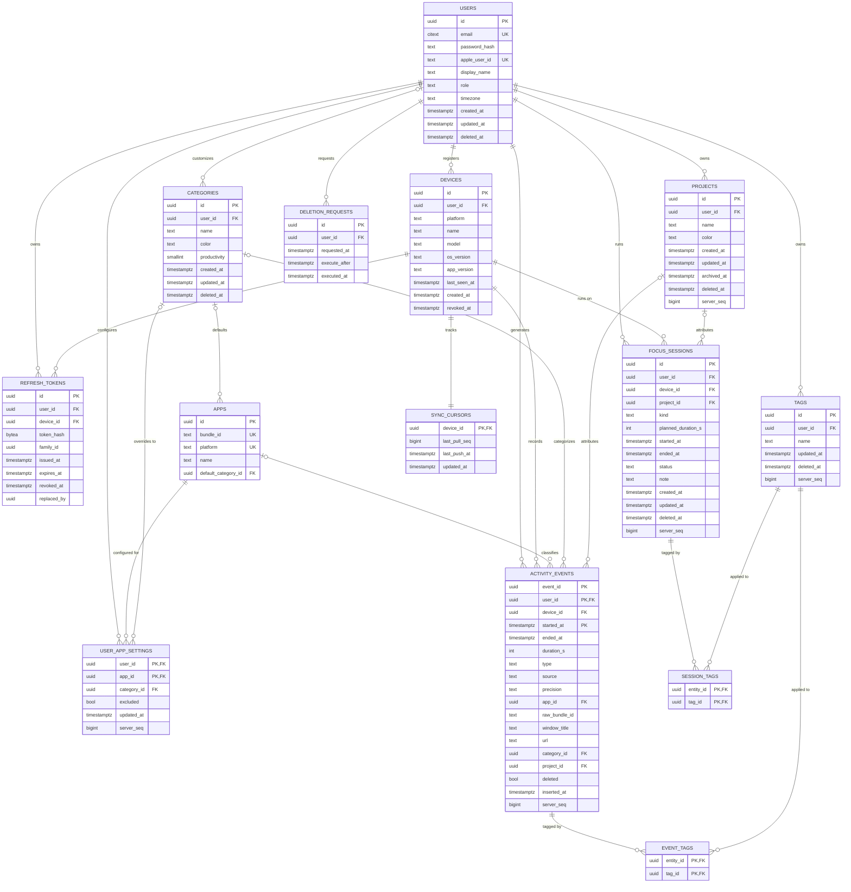

# Database Schema

This document specifies the PostgreSQL + TimescaleDB schema that backs [[architecture-backend]]. It covers every table, its columns, constraints, and indexes; the TimescaleDB hypertable and continuous aggregate design for activity data; and the migration policy used to evolve the schema over time. The wire contract that produces and consumes these rows during client/server sync is defined separately in [[sync-protocol]] and [[api-reference]]; authentication and token lifecycle detail referenced here (`refresh_tokens`, `deletion_requests`) is covered in depth in [[security]].

## Conventions

The schema follows a small set of conventions applied consistently across all tables:

- **Primary keys are UUIDs.** Server-generated rows use Postgres's `gen_random_uuid()`. Rows that originate on a client (activity events, focus sessions, projects, tags) are created with a client-supplied **UUIDv7** instead, so the identifier is both globally unique and time-ordered — this is what lets the backend deduplicate retried or replayed uploads without a round trip to allocate an ID first.
- **All timestamps are `timestamptz`.** Storing the timezone offset alongside every timestamp avoids ambiguity when a user's clients cross timezones or when the backend aggregates across users in different timezones.
- **Soft delete via `deleted_at`.** Tables that support user-initiated deletion carry a nullable `deleted_at` column rather than a hard `DELETE`, so that sync can propagate the tombstone to other devices and so deletions remain reversible until the GDPR grace period in `deletion_requests` expires (see [[security]]).
- **Syncable tables carry `server_seq BIGINT`.** Any table that a client pulls incrementally bumps `server_seq` on every write (insert or update). Sync pull requests page through this column with keyset pagination (`WHERE server_seq > :cursor ORDER BY server_seq`) rather than offset pagination, which stays correct and efficient regardless of how much data has accumulated. The full pull/push mechanics are specified in [[sync-protocol]].

> [!note] Open question
> The brief marks `server_seq` as present on `user_app_settings`, `projects`, `tags`, `activity_events`, and `focus_sessions`, but not on `users` or `categories`, even though both are user-editable and referenced by syncing clients (e.g., a display name change or a custom category edited on one device needs to reach another). It is not clear whether `users` and `categories` sync through a different mechanism or were simply omitted from the brief.

## Entity-Relationship Diagram

`PK, FK` above marks columns that are simultaneously part of a composite primary key and a foreign key, since Mermaid's ER notation does not have a dedicated combined marker.

## Tables

### users

The root identity table. A user authenticates either with a password (`password_hash`) or with Sign in with Apple (`apple_user_id`); both are nullable because a given account may use only one method.

| Column | Type | Constraints |
|---|---|---|
| id | uuid | PK, default `gen_random_uuid()` |
| email | citext | UNIQUE |
| password_hash | text | NULL |
| apple_user_id | text | UNIQUE, NULL |
| display_name | text | |
| role | text | CHECK (`role IN ('user','admin')`), DEFAULT `'user'` |
| timezone | text | |
| created_at | timestamptz | |
| updated_at | timestamptz | |
| deleted_at | timestamptz | NULL |

`citext` on `email` gives case-insensitive uniqueness and lookups without the application having to normalize case itself.

### devices

One row per client installation that has registered with the backend. `revoked_at` lets an admin or the user themselves invalidate a device (and, transitively, its refresh tokens) without deleting the row's history.

| Column | Type | Constraints |
|---|---|---|
| id | uuid | PK, default `gen_random_uuid()` |
| user_id | uuid | FK -> `users(id)` |
| platform | text | CHECK (`platform IN ('macos','ios')`) |
| name | text | |
| model | text | |
| os_version | text | |
| app_version | text | |
| last_seen_at | timestamptz | |
| created_at | timestamptz | |
| revoked_at | timestamptz | NULL |

### refresh_tokens

Implements refresh token rotation with reuse detection. Each rotation produces a new token in the same `family_id`; if a revoked or already-rotated token is presented again, the entire family can be revoked, which is the standard defense against a stolen refresh token being replayed after the legitimate client has already rotated past it. Full token-handling rules live in [[security]].

| Column | Type | Constraints |
|---|---|---|
| id | uuid | PK, default `gen_random_uuid()` |
| user_id | uuid | FK -> `users(id)` |
| device_id | uuid | FK -> `devices(id)` |
| token_hash | bytea | |
| family_id | uuid | rotation family, used for reuse detection |
| issued_at | timestamptz | |
| expires_at | timestamptz | |
| revoked_at | timestamptz | NULL |
| replaced_by | uuid | NULL, points to the token that superseded this one |

Indexes: `(user_id)`, `(family_id)`, `(token_hash)`. The `token_hash` index is what makes token validation on every authenticated request a single indexed lookup rather than a table scan; the `family_id` index is what makes "revoke everything in this rotation family" cheap when reuse is detected.

### apps

A global, cross-user catalog of applications, keyed by platform-specific bundle identifier. Rows are auto-populated the first time an app is seen during activity ingestion, so the catalog grows organically rather than being hand-curated up front.

| Column | Type | Constraints |
|---|---|---|
| id | uuid | PK, default `gen_random_uuid()` |
| bundle_id | text | UNIQUE with `platform` |
| platform | text | UNIQUE with `bundle_id` |
| name | text | |
| default_category_id | uuid | FK -> `categories(id)`, NULL |

`UNIQUE (bundle_id, platform)` reflects that the same bundle identifier can in principle mean different apps on different platforms, so uniqueness is scoped per platform rather than globally.

### categories

Categories classify time by productivity value (for example, "Deep Work" vs. "Distraction"). `user_id IS NULL` denotes a system default category available to every user; `user_id` set denotes a user's own custom category.

| Column | Type | Constraints |
|---|---|---|
| id | uuid | PK, default `gen_random_uuid()` |
| user_id | uuid | FK -> `users(id)`, NULL = system default |
| name | text | |
| color | text | |
| productivity | smallint | CHECK (`productivity BETWEEN -2 AND 2`) |
| created_at | timestamptz | |
| updated_at | timestamptz | |
| deleted_at | timestamptz | NULL |

The `productivity` scale (-2 to 2) is what downstream reporting sums to produce a "productive time" metric; it is a fixed five-point scale rather than an open-ended score.

### user_app_settings

Per-user overrides on top of the global `apps` catalog: a user can reassign an app to a different category than its `default_category_id`, or exclude it from tracking/reporting entirely.

| Column | Type | Constraints |
|---|---|---|
| user_id | uuid | PK (composite), FK -> `users(id)` |
| app_id | uuid | PK (composite), FK -> `apps(id)` |
| category_id | uuid | FK -> `categories(id)`, NULL (user override) |
| excluded | bool | DEFAULT `false` |
| updated_at | timestamptz | |
| server_seq | bigint | bumped on every write |

The composite primary key `(user_id, app_id)` enforces at most one settings row per user per app, so "override" is a natural upsert rather than requiring an application-level uniqueness check.

### projects

User-defined containers for attributing time (activity events and focus sessions) to a body of work.

| Column | Type | Constraints |
|---|---|---|
| id | uuid | PK, client-supplied UUIDv7 |
| user_id | uuid | FK -> `users(id)` |
| name | text | |
| color | text | |
| created_at | timestamptz | |
| updated_at | timestamptz | |
| archived_at | timestamptz | NULL |
| deleted_at | timestamptz | NULL |
| server_seq | bigint | bumped on every write |

`archived_at` and `deleted_at` are distinct: archiving hides a project from active selection lists without tombstoning it for sync, whereas `deleted_at` is a full soft delete.

### tags

Free-form labels applicable to both activity events and focus sessions via the join tables below.

| Column | Type | Constraints |
|---|---|---|
| id | uuid | PK, client-supplied UUIDv7 |
| user_id | uuid | FK -> `users(id)` |
| name | text | UNIQUE with `user_id` |
| updated_at | timestamptz | |
| deleted_at | timestamptz | NULL |
| server_seq | bigint | bumped on every write |

`UNIQUE (user_id, name)` prevents a user from creating two tags with the same name, while still letting different users use the same tag name independently.

### activity_events

The append-only, high-volume time-series table capturing every unit of tracked activity from every source (desktop automatic tracking, mobile Screen Time summaries, manual entry). This table is a **TimescaleDB hypertable**, partitioned on `started_at` with a **7-day chunk interval**. See [[architecture-desktop]] and [[architecture-mobile]] for what populates `type`/`source`/`precision` on each platform, and [[sync-protocol]] for how these rows are uploaded and deduplicated.

| Column | Type | Constraints |
|---|---|---|
| event_id | uuid | client-supplied UUIDv7 |
| user_id | uuid | FK -> `users(id)` |
| device_id | uuid | FK -> `devices(id)` |
| started_at | timestamptz | NOT NULL |
| ended_at | timestamptz | NOT NULL |
| duration_s | int | GENERATED |
| type | text | CHECK (`type IN ('app_active','idle','locked','mobile_usage','manual')`) |
| source | text | CHECK (`source IN ('desktop','mobile','manual')`) |
| precision | text | CHECK (`precision IN ('exact','approximate')`), DEFAULT `'exact'` |
| app_id | uuid | FK -> `apps(id)`, NULL |
| raw_bundle_id | text | NULL |
| window_title | text | NULL |
| url | text | NULL |
| category_id | uuid | FK -> `categories(id)`, NULL |
| project_id | uuid | FK -> `projects(id)`, NULL |
| deleted | bool | DEFAULT `false` |
| inserted_at | timestamptz | |
| server_seq | bigint | bumped on every write |

Primary key: `(user_id, started_at, event_id)`. TimescaleDB requires the partitioning column (`started_at`) to be part of any primary key or unique constraint on a hypertable, which is why the PK is composite rather than `event_id` alone — see the Hypertable Notes section below for the full rationale.

Idempotency constraint: `UNIQUE (user_id, event_id, started_at)`. This is what lets an upload retry safely re-submit the same event without creating a duplicate row, complementing the client-generated UUIDv7 `event_id`.

Indexes:

- `(user_id, started_at DESC)` — the primary access pattern for "this user's activity, most recent first," used by timeline and report views.
- `(user_id, app_id, started_at)` — supports per-app time breakdowns for a user over a range.
- `(user_id, server_seq)` — supports sync pull's keyset pagination for this table.

Compression policy: chunks older than 30 days are compressed. Retention policy: optional/configurable (not a fixed default), so that data lifetime can be tuned per deployment or per user preference rather than being hard-coded.

`deleted` (a boolean flag) coexists with the soft-delete convention used elsewhere; unlike other tables' `deleted_at`, this table uses a plain flag, which is consistent with activity events being append-only and never truly mutated — a "deletion" here is a correction event's flag, not a lifecycle timestamp.

> [!note] Open question
> The brief specifies `duration_s int GENERATED` but does not give the generation expression. The natural computation is `EXTRACT(EPOCH FROM (ended_at - started_at))::int`, but this is not stated explicitly in the brief and should be confirmed before the migration is written.

### focus_sessions

Explicit, user-initiated sessions (a Pomodoro-style focus block, a break, or a meeting), as opposed to the automatically captured rows in `activity_events`.

| Column | Type | Constraints |
|---|---|---|
| id | uuid | PK, client-supplied UUIDv7 |
| user_id | uuid | FK -> `users(id)` |
| device_id | uuid | FK -> `devices(id)` |
| project_id | uuid | FK -> `projects(id)`, NULL |
| kind | text | CHECK (`kind IN ('focus','break','meeting')`) |
| planned_duration_s | int | NULL |
| started_at | timestamptz | |
| ended_at | timestamptz | NULL |
| status | text | CHECK (`status IN ('running','completed','abandoned')`) |
| note | text | |
| created_at | timestamptz | |
| updated_at | timestamptz | |
| deleted_at | timestamptz | NULL |
| server_seq | bigint | bumped on every write |

`ended_at` is nullable and `status` can be `'running'` because a session is created when it starts, not when it finishes; a session that is neither completed nor explicitly abandoned by the time a client checks in is what the sync protocol's reconciliation logic in [[sync-protocol]] resolves.

### event_tags / session_tags

Join tables attaching tags to, respectively, activity events and focus sessions.

| Column | Type | Constraints |
|---|---|---|
| entity_id | uuid | PK (composite) |
| tag_id | uuid | PK (composite), FK -> `tags(id)` |

Both tables share the same shape: primary key `(entity_id, tag_id)`.

> [!note] Open question
> The brief names the first column `entity_id` in both `event_tags` and `session_tags` without stating its foreign-key target explicitly; by context, `event_tags.entity_id` references `activity_events` and `session_tags.entity_id` references `focus_sessions`. For `event_tags` specifically this is not a straightforward single-column foreign key: `activity_events`'s primary key is the composite `(user_id, started_at, event_id)`, so a plain `entity_id -> activity_events(event_id)` reference requires a separate unique constraint on `event_id` alone (or the join table must itself carry `user_id`/`started_at` to reference the composite key). This should be resolved before the migration is written.

### sync_cursors

One row per device, tracking that device's sync pull progress against the server's global `server_seq` sequence space.

| Column | Type | Constraints |
|---|---|---|
| device_id | uuid | PK, FK -> `devices(id)` |
| last_pull_seq | bigint | |
| last_push_at | timestamptz | |
| updated_at | timestamptz | |

Keying this table by `device_id` rather than `user_id` is what allows two devices belonging to the same user to be at different points in the pull stream simultaneously, which is necessary since each device syncs independently per [[sync-protocol]].

### deletion_requests

Implements the GDPR-mandated grace period between a user requesting account deletion and that deletion actually being executed, so a request can be cancelled within the window. Full policy and execution mechanics are covered in [[security]].

| Column | Type | Constraints |
|---|---|---|
| id | uuid | PK, default `gen_random_uuid()` |
| user_id | uuid | FK -> `users(id)` |
| requested_at | timestamptz | |
| execute_after | timestamptz | |
| executed_at | timestamptz | NULL |

`executed_at` remaining NULL is what distinguishes a pending, cancellable request from one that has already been carried out.

> [!note] Open question
> The brief lists `deletion_requests`' columns without explicit types; the types above (`uuid` for `id`/`user_id`, `timestamptz` for the three date fields) are inferred by applying this document's stated conventions, not given directly in the brief.

## Continuous Aggregates

Three TimescaleDB continuous aggregates sit on top of `activity_events`:

- `daily_app_totals(user_id, day, app_id, total_s)`
- `daily_category_totals(user_id, day, category_id, total_s)`
- `hourly_category_totals(user_id, hour, category_id, total_s)`

These are **continuous aggregates**, not application-maintained rollup tables populated by a cron job or backend batch process. That choice matters for three reasons:

1. **Automatic refresh.** A continuous aggregate has a refresh policy attached to it directly in TimescaleDB; the database keeps the materialized rollups current on a schedule without the backend needing its own scheduler, job queue, or failure-handling code for rollup maintenance.
2. **Correctness under late or out-of-order inserts.** Because `activity_events` ingests from offline-first clients (see [[architecture-desktop]] and [[architecture-mobile]]), events for a given hour or day can arrive well after that period has "closed" — for example, a mobile device syncing hours of Screen Time data after being offline overnight. A hand-rolled rollup job that runs once and moves on would silently miss or under-count such late arrivals. Continuous aggregates track which underlying chunks have changed and incrementally re-materialize only the affected buckets, so late data is folded in correctly without a full recompute.
3. **Compression-aware.** Continuous aggregates can be queried transparently over both compressed and uncompressed chunks of the underlying hypertable. A hand-rolled rollup would need explicit branching logic to handle the compressed, older portion of `activity_events` differently from the recent, uncompressed portion.

## Hypertable Notes

`activity_events` is the highest-volume table in the schema (one row per tracked activity segment per device, continuously, for every active user), which is why it is the one table implemented as a hypertable rather than a plain table.

- **Why the primary key must include `started_at`.** TimescaleDB partitions a hypertable's rows into chunks by the value of the partitioning column, and it can only enforce a primary key or unique constraint if that constraint's columns include the partitioning column — otherwise uniqueness could only be checked by scanning every chunk. This is why the primary key is `(user_id, started_at, event_id)` rather than `event_id` alone, and why the idempotency constraint is likewise `(user_id, event_id, started_at)` rather than just `(user_id, event_id)`.
- **Why a 7-day chunk interval.** A chunk interval controls how much data lives in each underlying physical table. Seven days keeps each chunk's size and index footprint in a range that suits both write-heavy recent activity (most queries and inserts touch only the last one or two chunks) and the compression and retention policies below, which operate at chunk granularity — a chunk can only be compressed or dropped once it is entirely outside the relevant policy window, so a week-sized chunk gives reasonably fine-grained control without creating an unmanageable number of chunks per user over time.
- **Compression policy.** Chunks older than 30 days are compressed. By that age, a chunk is effectively read-only (historical activity is not corrected after a month) and is queried far less frequently, in bulk, for reporting rather than for live timeline views — exactly the access pattern TimescaleDB's columnar compression is optimized for.
- **Retention policy.** Optional and configurable, rather than a fixed default. This leaves how long raw activity is retained as a deployment- or user-level policy decision, distinct from the account-level GDPR grace period modeled by `deletion_requests`.
- **Today's partial data.** Continuous aggregates materialize completed buckets on their refresh schedule, but the current, still-accumulating bucket (today's totals, or the current hour's) is necessarily incomplete in the materialized view at any given moment. TimescaleDB's continuous aggregates support real-time aggregation: a query against the aggregate transparently unions the materialized historical buckets with a live aggregation over the raw, not-yet-materialized rows in the current chunk, so a report for "today" is always correct as of query time without the application having to special-case the current period itself.

## Migration Policy

Schema changes are managed with `golang-migrate` and are **forward-only**: every change ships as a new numbered migration rather than being reconciled by editing or reverting a previous one. This keeps the migration history a linear, replayable record of how the schema reached its current state, which matters for a schema with hypertables and continuous aggregates, since those objects carry TimescaleDB-specific creation and alteration steps that are not straightforward to express as an automatic "down" migration. Tooling, execution environment, and how migrations fit into deployment are covered in [[architecture-backend]].

## Related

- [[architecture-backend]]
- [[sync-protocol]]
- [[api-reference]]
- [[security]]
- [[system-overview]]
