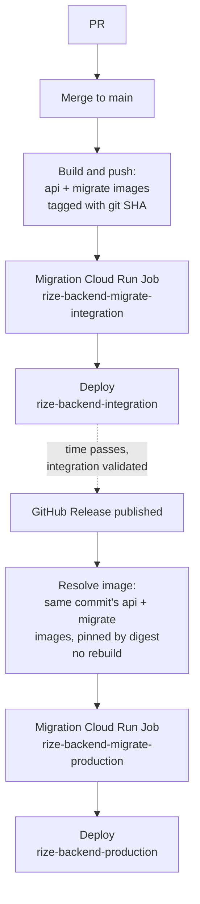

# Deployment

This document is the architecture-suite companion to `rize-backend/docs/deployment.md`. It describes, at a level suitable for anyone reasoning about the system's operational shape, the two deployment environments, the promotion pipeline between them, and the key design decisions behind it. For the one-time GCP bootstrap procedure (exact `gcloud`/`gh` commands to create the Workload Identity Federation pool, service accounts, Secret Manager secrets, and repository secrets/vars), see `rize-backend/docs/deployment.md` — that detail is intentionally kept in the repo, not duplicated here.

`rize-backend` deploys to Google Cloud Run on Google Cloud's free tier. CI (lint/test/vuln/docker-build on every PR and push to `main`) is a separate, unaffected pipeline from the deployment flow described below.

## Environments

| | Integration | Production |
|---|---|---|
| Trigger | Push to `main` | GitHub Release published |
| Cloud Run service | `rize-backend-integration` | `rize-backend-production` |
| Cloud Run migration Job | `rize-backend-migrate-integration` | `rize-backend-migrate-production` |
| `ENVIRONMENT` value | `staging` | `production` |
| Image source | Built fresh from the pushed commit | The same image already built and pushed for the release's target commit — never rebuilt |

> [!note] Open question
> `internal/config/config.go`'s `validEnvironments` set is `{development, staging, production}` — there is no literal `"integration"` value. The integration Cloud Run service therefore runs with `ENVIRONMENT=staging` as the closest semantic fit. Whether a dedicated `"integration"` environment value should be added upstream is not addressed by the current implementation.

## Pipeline

In both workflows the migration Job runs to completion (`--wait`) before the Cloud Run service deploy step, so a failed migration blocks the traffic-affecting deploy. Production never builds its own image: `deploy-production.yml`'s image-resolution step fails loudly if the release's target commit does not already have a successful integration build in Artifact Registry.

## Key design points

**Workload Identity Federation.** GitHub Actions authenticates to GCP via Workload Identity Federation rather than a downloaded service account key file. This removes long-lived credentials from CI secrets entirely — the deployer service account is impersonated per-run via a short-lived token tied to the calling GitHub repository, so there is no key material to rotate, leak, or accidentally commit.

**Dedicated runtime service account with per-secret access.** Both Cloud Run services and both migration Jobs run as a `rize-backend-runtime` service account, distinct from the GitHub Actions deployer service account. The runtime service account is granted `roles/secretmanager.secretAccessor` per individual secret rather than a project-wide Secret Manager role, so a compromised runtime identity can only read the specific database URL and JWT signing key secrets it was explicitly bound to, not every secret in the project.

**Migration-before-deploy ordering and the expand/contract invariant.** The migration Job is deployed and executed to completion before the corresponding Cloud Run service deploy step runs, guaranteeing the schema is migrated before any new application revision can receive traffic. Because the previous revision keeps serving traffic during the deploy window (most consequentially in production, where a health-check-gated traffic shift takes some time), every migration must be backward-compatible with the previous revision: expand changes (additive — new tables, new nullable columns, new columns with a default, new indexes) are safe to ship on their own; contract changes (dropping a column, dropping a table, renaming a column, tightening a constraint old code relies on being loose) must land as a separate, later migration only after a revision that no longer depends on the old shape is already deployed and stable.

**Digest-pinned production promotion.** Production is never deployed by mutable git-SHA tag. `deploy-production.yml` resolves the release's target commit to the immutable content digests of the already-built api and migrate images and deploys/executes by `<image>@sha256:<digest>`. This closes the gap where a tag could be repointed at a different image after the fact — intentionally or via a compromised credential — and slip an uninspected build into what is meant to be a promotion of an already-validated integration build. Integration continues to deploy by tag, since it builds and pushes the image itself in the same run.

**Per-environment JWT signing keys.** `INTEGRATION_JWT_SIGNING_KEY_SECRET` and `PRODUCTION_JWT_SIGNING_KEY_SECRET` are separate Secret Manager secrets holding distinct PEM-encoded RSA keys, never a shared key. This ensures staging cannot mint a token that a production instance would accept: a shared signing key would let anyone who obtains an integration-issued token (a lower-trust environment) authenticate against production. See [[security]] for the broader authentication and token model this fits into.

**Public access model.** Both Cloud Run services are deployed with `--allow-unauthenticated`. This is a public API by design — Cloud Run ingress does not gate requests by IAM identity. Request-level authentication and authorization are handled entirely by the application's own JWT layer, described in [[security]], not by the platform.

**`--max-instances=2` free-tier cost cap.** Both services are deployed with `--max-instances=2`, capping the worst-case autoscaling blast radius from a traffic spike or a bug that drives request volume up, keeping usage inside Cloud Run's always-free monthly quota.

**Concurrency groups.** `deploy-integration.yml` and `deploy-production.yml` each run under their own concurrency group (`deploy-integration` and `deploy-production` respectively, with `cancel-in-progress: false`), so overlapping triggers for the same environment queue rather than run concurrently or cancel an in-flight deploy mid-migration.

## GitHub secrets and variables

All entries below are GitHub Actions repository secrets except the two CORS entries, which are repository variables. Bootstrap commands that produce each value are in `rize-backend/docs/deployment.md`.

| Name | Kind | Purpose |
|---|---|---|
| `GCP_PROJECT_ID` | secret | GCP project ID; also acts as the deploy on/off switch — both workflows guard on it being set. |
| `GCP_WIF_PROVIDER` | secret | Full resource name of the Workload Identity Federation provider. |
| `GCP_SERVICE_ACCOUNT` | secret | Email of the deployer service account impersonated via WIF. |
| `GCP_REGION` | secret | Cloud Run / Artifact Registry region. |
| `INTEGRATION_DATABASE_URL_SECRET` | secret | Secret Manager reference to the integration DB connection string. |
| `PRODUCTION_DATABASE_URL_SECRET` | secret | Secret Manager reference to the production DB connection string. |
| `INTEGRATION_JWT_SIGNING_KEY_SECRET` | secret | Secret Manager reference to the integration-only JWT signing key. |
| `PRODUCTION_JWT_SIGNING_KEY_SECRET` | secret | Secret Manager reference to the production-only JWT signing key. |
| `INTEGRATION_CORS_ALLOWED_ORIGINS` | variable | Comma-separated allowed CORS origins for integration. |
| `PRODUCTION_CORS_ALLOWED_ORIGINS` | variable | Comma-separated allowed CORS origins for production. |

## Free-tier constraints

Cloud Run's always-free monthly quota (requests, memory GB-seconds, vCPU-seconds, and North America egress) comfortably covers two small, low-traffic services (integration + production) at this project's current scale.

Cloud SQL has no free tier — every instance is billed continuously, even the smallest tier. The two options to choose between at bootstrap time: a free-tier managed Postgres provider (e.g. Neon or Supabase), keeping the whole stack at $0/month, or Cloud SQL's smallest tier (`db-f1-micro`) at roughly $10–15/month per instance, doubled across integration and production, in exchange for staying inside GCP IAM/networking.

Whichever Postgres target is chosen, there is a known, unresolved consideration: this project's migrations create TimescaleDB continuous aggregates (`daily_app_totals`, `daily_category_totals`, `hourly_category_totals`, see [[architecture-backend]] §Aggregation Strategy), which require the TimescaleDB extension. Neon, Supabase, and plain Cloud SQL Postgres do not support the TimescaleDB extension out of the box, so the continuous-aggregate migration steps will fail against any of those targets as-is. This is not addressed by the current implementation — resolving it (a Timescale-capable managed offering such as Timescale Cloud, or making the continuous-aggregate migration steps conditional/optional for non-Timescale targets) is a decision left to whoever picks the concrete database target at bootstrap.

## Related

- [[architecture-backend]] — service layering, ingestion pipeline, aggregation strategy, and the containerization/local-development setup this deployment pipeline builds on.
- [[observability]] — error and performance tracking across environments.
- [[security]] — authentication and token model, including the JWT layer that backs the public access model above.
