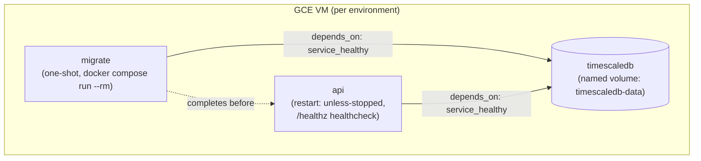
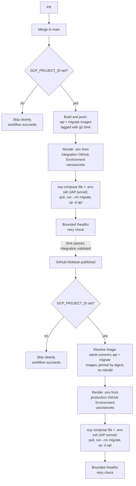

# Deployment

This document is the architecture-suite companion to `rize-backend/docs/deployment.md`. It describes, at a level suitable for anyone reasoning about the system's operational shape, the two deployment environments, the promotion pipeline between them, and the key design decisions behind it. For the one-time GCE VM bootstrap procedure (exact `gcloud`/`gh` commands to create the Workload Identity Federation pool, service accounts, firewall rules, and GitHub Environment vars/secrets), see `rize-backend/docs/deployment.md` — that detail is intentionally kept in the repo, not duplicated here.

`rize-backend` deploys its **full stack** — the api process, TimescaleDB, and a one-shot migration step, all via `docker compose` — to a single **Google Compute Engine (GCE) VM per environment**. CI (lint/test/vuln/docker-build on every PR and push to `main`) is a separate, unaffected pipeline from the deployment flow described below.

> [!note] Superseded design
> This deployment previously targeted Cloud Run, with the database as an external managed-Postgres dependency. That design left TimescaleDB extension support as an explicitly unresolved gap (see [[#TimescaleDB extension: resolved]] below). It has been superseded by the GCE-based design described in this document.

## Environments

| | Integration | Production |
|---|---|---|
| Trigger | Push to `main` | GitHub Release published |
| GitHub Environment | `integration` | `production` |
| GCE VM | `vars.GCE_INSTANCE` in the `integration` GitHub Environment (e.g. `rize-backend-integration`) | `vars.GCE_INSTANCE` in the `production` GitHub Environment (e.g. `rize-backend-production`) |
| `ENVIRONMENT` value | `staging` | `production` |
| Image source | Built fresh from the pushed commit | The same image already built and pushed for the release's target commit — resolved and deployed by immutable digest, never rebuilt |

> [!note] Open question
> `internal/config/config.go`'s `validEnvironments` set is `{development, staging, production}` — there is no literal `"integration"` value. The integration deploy therefore runs the api container with `ENVIRONMENT=staging` as the closest semantic fit. Whether a dedicated `"integration"` environment value should be added upstream is not addressed by the current implementation.

## Architecture: one VM, one compose stack, per environment

Each environment is a single GCE VM (`e2-small` by default) running Docker plus the Compose plugin. A deploy renders that environment's `.env` file from its GitHub Environment vars/secrets, copies it together with the deploy compose file to the VM, and runs the stack over an IAP-tunneled SSH session — no long-lived public SSH exposure and no secrets baked into an image.



The compose stack has three services:

- **`timescaledb`** — TimescaleDB, with its data on the named volume `timescaledb-data` so it survives redeploys. It is started implicitly as a dependency of `migrate` and `api` and is not restarted on every deploy if it is already running and healthy.
- **`migrate`** — a one-shot `docker compose run --rm` invocation; never part of `up`, so it never lingers as a running container.
- **`api`** — the application container, `restart: unless-stopped`, with a `/healthz` healthcheck used both by Docker and by the post-deploy check below.

A deploy runs the following, over `gcloud compute ssh --tunnel-through-iap`:

```bash
sudo docker compose --env-file .env pull                    # pull api + migrate + timescaledb images
sudo docker compose --env-file .env run --rm -T migrate      # one-shot migration, blocks until done, exits
sudo docker compose --env-file .env up -d api                # (re)start the api container only
```

These run under `sudo` because the deploy SSH session is not a member of the `docker` group on the VM; `-T` on the migrate invocation disables pseudo-TTY allocation, since the command runs non-interactively over the SSH session.

This mirrors local development's `docker compose up` (same TimescaleDB image, same migration-then-api ordering), but with pre-built images from Artifact Registry instead of a local build, and real per-environment secrets instead of hardcoded local credentials. `.env` is rendered fresh on every deploy — never committed, never logged — chmod'd `600` on the VM and deleted immediately after `up -d api` completes.

## Pipeline



In both workflows the migration step runs to completion and exits successfully before `docker compose up -d api` runs, so a failed migration blocks the traffic-affecting deploy step. The post-deploy `/healthz` check runs last and fails the workflow if the api container doesn't answer with 200 within its bounded retry window. Production never builds its own image: the image-resolution step fails loudly if the release's target commit does not already have a successful integration build in Artifact Registry.

## Key design points

**Workload Identity Federation.** GitHub Actions authenticates to GCP via Workload Identity Federation rather than a downloaded service account key file. This removes long-lived credentials from CI secrets entirely — the deployer service account is impersonated per-run via a short-lived token tied to the calling GitHub repository, so there is no key material to rotate, leak, or accidentally commit.

**GitHub Environments hold all runtime configuration.** The GitHub Environments named `integration` and `production` hold every runtime application setting the deploy workflows need — vars `GCE_INSTANCE`, `GCE_ZONE`, `CORS_ALLOWED_ORIGINS`, and secrets `POSTGRES_PASSWORD`, an optional `DATABASE_URL` override, and `JWT_SIGNING_KEY`. No GCP Secret Manager involvement for app config: the VM is the only place these secrets need to live besides GitHub itself. Repo-level GCP bootstrap secrets (`GCP_PROJECT_ID`, `GCP_REGION`, `GCP_WIF_PROVIDER`, `GCP_SERVICE_ACCOUNT`) are unchanged and shared across both environments — see [[#GitHub secrets and variables]] below.

**Migration-before-deploy ordering and the expand/contract invariant.** The migration step is executed to completion before the `api` container is (re)started, guaranteeing the schema is migrated before any new application revision can receive traffic. Because the previous `api` container keeps running until `docker compose up -d api` replaces it, there is always a window — however brief — during which the already-migrated schema is being served by the still-running previous revision. Every migration must therefore be backward-compatible with the previous revision: expand changes (additive — new tables, new nullable columns, new columns with a default, new indexes) are safe to ship on their own; contract changes (dropping a column, dropping a table, renaming a column, tightening a constraint old code relies on being loose) must land as a separate, later migration only after a revision that no longer depends on the old shape is already deployed and stable.

**Digest-pinned production promotion.** Production is never deployed by mutable git-SHA tag. The production deploy resolves the release's target commit to the immutable content digests of the already-built api and migrate images and deploys/executes by `<image>@sha256:<digest>`. This closes the gap where a tag could be repointed at a different image after the fact — intentionally or via a compromised credential — and slip an uninspected build into what is meant to be a promotion of an already-validated integration build. Integration continues to deploy by tag, since it builds and pushes the image itself in the same run.

**Per-environment JWT signing keys.** The `JWT_SIGNING_KEY` secret in the `integration` GitHub Environment and the `JWT_SIGNING_KEY` secret in the `production` GitHub Environment hold distinct PEM-encoded RSA keys, never a shared key. This ensures staging cannot mint a token that a production instance would accept: a shared signing key would let anyone who obtains an integration-issued token (a lower-trust environment) authenticate against production. See [[security]] for the broader authentication and token model this fits into.

**Public access model.** The API port is open to `0.0.0.0/0` on both VMs; SSH is reachable only via Google's Identity-Aware Proxy range, never a direct public SSH port. Request-level authentication and authorization are handled entirely by the application's own JWT layer, described in [[security]], not by the platform.

**TimescaleDB on a named volume, surviving redeploys.** Because TimescaleDB now runs inside the deploy compose stack rather than as an external managed database, its data lives on the named volume `timescaledb-data` on the VM's persistent disk. A redeploy replaces the `api` container but leaves `timescaledb` and its volume untouched unless the volume itself is explicitly removed.

**One-time VM bootstrap.** Each environment's VM is created once via `deploy/bootstrap-gce.sh`: Debian 12, `e2-small` by default, Docker + Compose plugin installed via a startup script, SSH reachable only through IAP, and the API port public. The script is safe to re-run — every step checks for existing state before creating anything. Exact commands and IAM grants are in `rize-backend/docs/deployment.md`.

## GitHub secrets and variables

Deployment configuration comes from two places:

1. **Repo-level secrets** — the GCP bootstrap identity, shared across both environments, set once during the one-time GCP project bootstrap:

   | Name | Kind | Purpose |
   |---|---|---|
   | `GCP_PROJECT_ID` | secret | GCP project ID; also acts as the deploy on/off switch — both workflows guard on it being set. |
   | `GCP_WIF_PROVIDER` | secret | Full resource name of the Workload Identity Federation provider. |
   | `GCP_SERVICE_ACCOUNT` | secret | Email of the deployer service account impersonated via WIF. |
   | `GCP_REGION` | secret | Compute Engine / Artifact Registry region. |

2. **Per-environment vars/secrets**, via GitHub Environments named `integration` and `production` — every runtime application setting comes from here:

   | Name | Kind | Purpose |
   |---|---|---|
   | `GCE_INSTANCE` | var | Name of this environment's VM, created by `deploy/bootstrap-gce.sh`. |
   | `GCE_ZONE` | var | Zone the VM lives in. |
   | `CORS_ALLOWED_ORIGINS` | var | Comma-separated allowed CORS origins for this environment. Per [[security]] §API hardening, this must never be `*` outside `development`. |
   | `POSTGRES_PASSWORD` | secret | Password for the in-stack TimescaleDB container's `rize` user; also used to build `DATABASE_URL` if that secret isn't set. |
   | `DATABASE_URL` | secret | Optional full Postgres connection string override, e.g. to point at a database other than the in-stack `timescaledb` container. |
   | `JWT_SIGNING_KEY` | secret | PEM-encoded RSA signing key used by this environment's api container only. |

   Only the `deploy` job in each workflow declares `environment: integration` / `environment: production`, so these are the only secrets/vars visible to it; the build/resolve jobs use only the repo-level secrets above.

## Free-tier constraints

Compute Engine has no perpetual free-tier equivalent to Cloud Run's; two `e2-small` VMs (integration + production) are the primary ongoing cost, budgeted at roughly one to two small always-on instances' worth of compute per month. `e2-micro` is available in some regions under "always free" terms and can be substituted if the workload (TimescaleDB alongside the api process) fits within it — likely comfortable only for light integration testing.

TimescaleDB's data volume (`timescaledb-data`) lives on the VM's persistent disk. Back it up out-of-band (e.g. periodic `pg_dump` to a bucket) if data durability beyond "the VM disk stays intact" matters for a given environment — automated backups are not part of this deployment design.

## TimescaleDB extension: resolved

Previously, this document flagged an unresolved hosting gap: this project's migrations create TimescaleDB continuous aggregates (`daily_app_totals`, `daily_category_totals`, `hourly_category_totals`, see [[architecture-backend]] §Aggregation Strategy and [[database-schema]] §Continuous Aggregates), which require the TimescaleDB extension, and none of Cloud SQL, Neon, or Supabase support that extension out of the box against a Cloud Run-based deployment. Running the full stack — including TimescaleDB itself — as a `docker compose` unit on one VM per environment resolves this directly: the same TimescaleDB image used locally is what runs in integration and production, so the extension is always present by construction. No migration changes were needed, and there is no external managed-Postgres compromise to make. The tradeoff is that this project now owns VM patching, uptime, and backups for the database instead of a managed provider — accepted deliberately in favor of removing the extension-support gap.

## Related

- [[architecture-backend]] — service layering, ingestion pipeline, aggregation strategy, and the containerization/local-development setup this deployment pipeline builds on.
- [[observability]] — error and performance tracking across environments.
- [[security]] — authentication and token model, including the JWT layer that backs the public access model above.
