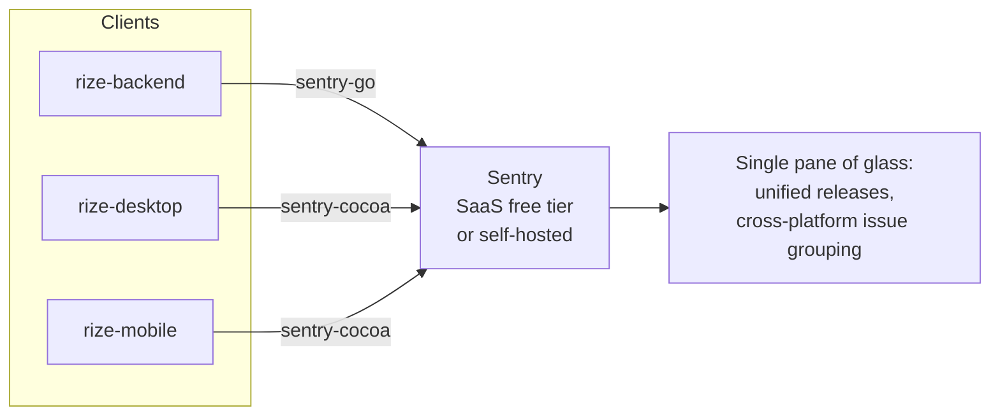
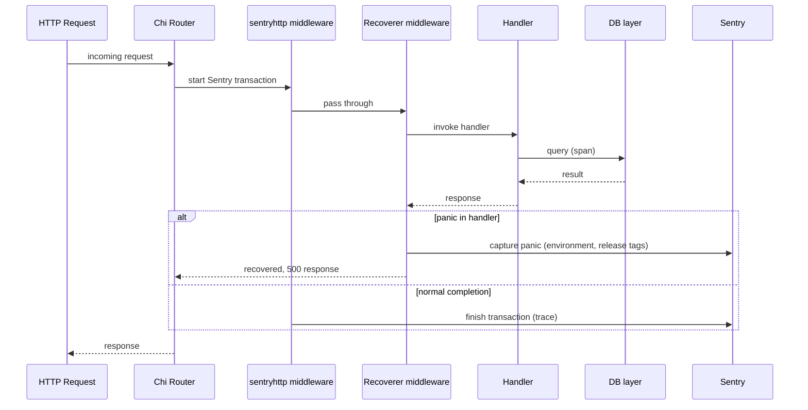
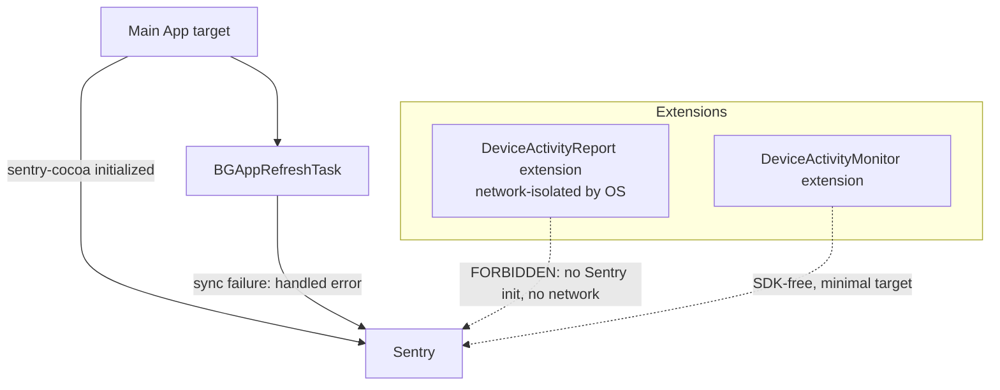
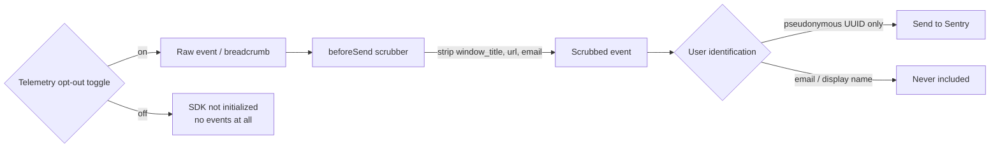

# Observability

This document specifies error tracking and performance monitoring across all three Rize-Clone projects: `rize-backend`, `rize-desktop`, and `rize-mobile`. It covers the tool decision, alternatives considered, per-project SDK integration, the boundary with existing metrics tooling, and the privacy rules that every SDK configuration must satisfy.

## Requirement

Every project needs error tracking and performance monitoring using a free tool.

## Decision

**Sentry** is used for all three projects. The free requirement is satisfied two ways:

1. Sentry SaaS free Developer tier.
2. Sentry is fully open-source and self-hostable via docker-compose at zero license cost if free-tier quotas are outgrown.

Standardizing on one platform for all three apps gives a single pane of glass, unified release tagging, and cross-platform issue grouping.

> [!note] Open question
> The brief does not specify a migration trigger or threshold for moving from the Sentry SaaS free tier to self-hosted Sentry (or to the GlitchTip fallback). Quota limits, cost thresholds, and the operational owner for a self-hosted deployment are undefined.

## Alternatives considered

| Tool | Free offering | Why rejected |
|---|---|---|
| Firebase Crashlytics | Free | No Go/backend support; ties clients to the Google/Firebase SDK stack |
| GlitchTip | Open-source, Sentry-API-compatible, lighter to self-host | Not rejected outright — documented as the fallback if self-hosted Sentry is too heavy; same SDKs work against it |
| Rollbar / Bugsnag | Free tiers too small | Not self-hostable |
| Hand-rolled logging only | N/A | No crash grouping, no release health, no tracing |

GlitchTip is retained as a documented fallback rather than a rejected alternative: because it is Sentry-API-compatible, the same `sentry-go` and `sentry-cocoa` SDK integrations described below can be pointed at a GlitchTip instance without code changes, only a DSN change.

## Per-project integration

### rize-backend

See [[architecture-backend]] for the service layering and middleware stack this integrates into.

- SDK: `sentry-go`, wired through the `sentryhttp`/Chi middleware.
- Panics are captured alongside the existing recoverer middleware — Sentry does not replace panic recovery, it observes it.
- Performance tracing is enabled on HTTP handlers, with DB query spans nested under each handler's transaction.
- Every event carries `environment` and `release` tags.

**Boundary with existing observability**: [[architecture-backend]] already specifies Prometheus + Grafana for metrics and alerting via `/metrics`. That boundary is preserved:

- Prometheus + Grafana own metrics and alerting.
- Sentry owns errors, crash grouping, and distributed traces.
- Metrics must not be duplicated into Sentry.

### rize-desktop

See [[architecture-desktop]] for the tracking pipeline and state machine this integrates into.

- SDK: `sentry-cocoa` via Swift Package Manager.
- Crash reporting works in Developer ID (non-App-Store, notarized) apps.
- Performance monitoring covers app start and UI hangs.
- Breadcrumbs are limited to app lifecycle events only.

### rize-mobile

See [[architecture-mobile]] for the extension architecture and entitlements this integrates into.

- SDK: `sentry-cocoa` via SPM.
- Crash detection and app-hang (watchdog) detection are both enabled.
- `BGAppRefreshTask` sync failures are reported as handled errors (not fatal crashes).

**HARD RULE**: Sentry must never be initialized inside the DeviceActivityReport extension. That extension is network-isolated by the OS, so events can never be delivered, and the repo rule forbids network use there entirely. The DeviceActivityMonitor extension must also remain SDK-free — extension targets stay minimal.

## Privacy rules

These rules must align with [[security]].

- `sendDefaultPii = false` on every SDK.
- `beforeSend` scrubbers strip `window_title`, `url`, and email addresses from events and breadcrumbs.
- User identification in events is the pseudonymous user UUID only — never email or display name.
- No tracked-activity payloads (activity events, focus session notes) in breadcrumbs or event extras.
- Clients expose a telemetry opt-out toggle in Settings; when off, the SDK is not initialized.
- DSNs are client-visible identifiers, not secrets, but live in build configuration rather than source.

> [!note] Open question
> The brief does not specify how the telemetry opt-out toggle state is persisted or synced (e.g., whether it is a local-only client setting or a synced user preference), nor whether toggling it off mid-session tears down an already-initialized SDK instance or only prevents initialization on next launch.

## Related

- [[architecture-backend]]
- [[architecture-desktop]]
- [[architecture-mobile]]
- [[security]]
- [[system-overview]]
