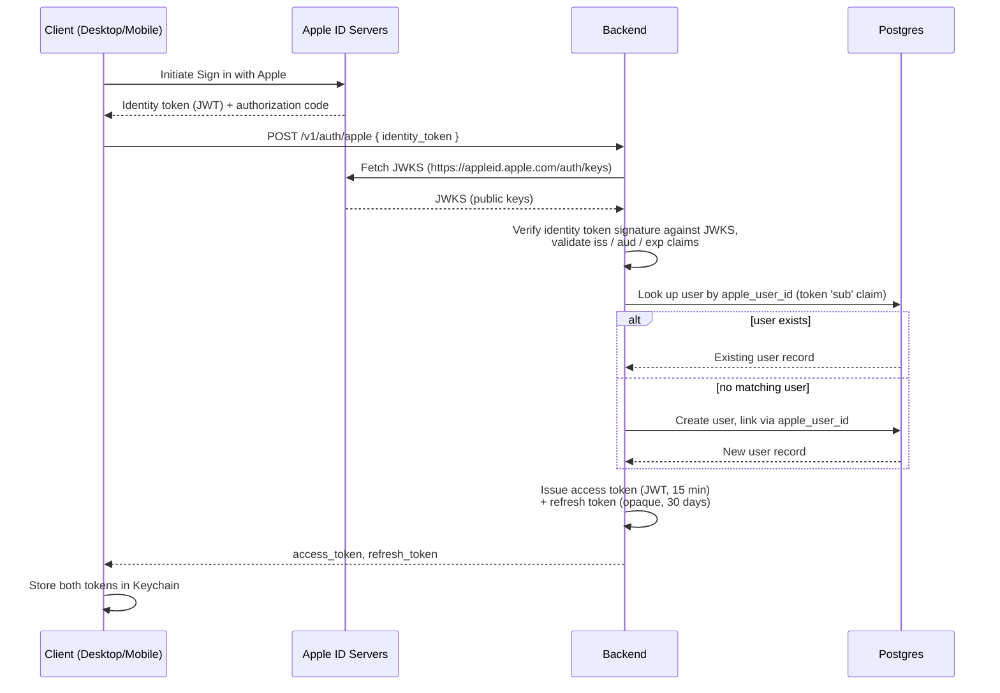
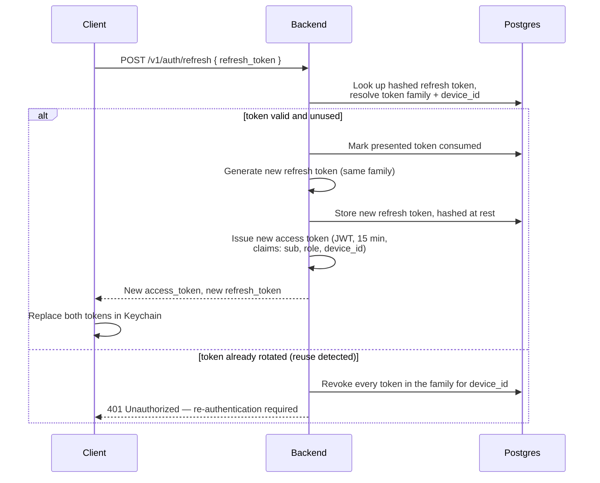

# Security

This document is the single source of truth for authentication, token handling, transport, data-at-rest, privacy, RBAC, API hardening, and GDPR/data-lifecycle requirements for Rize-Clone. It applies across all three codebases — [[architecture-desktop]], [[architecture-mobile]], and [[architecture-backend]] — and is the specification against which [[api-reference]] routes and [[database-schema]] columns should be checked. The final [[#Security checklist]] section is the canonical list a code reviewer should cite when assessing whether a change meets these requirements.

## Authentication design

Rize-Clone supports two authentication methods: Sign in with Apple as the primary method, and email/password as a secondary method. Both methods converge on the same token model described in [[#Token model]].

### Sign in with Apple (primary)

Sign in with Apple is the primary authentication method for both clients. The flow is:

1. The client obtains an identity token (a signed JWT) and an authorization code from Apple's native Sign in with Apple UI.
2. The client sends the identity token to the backend at `POST /v1/auth/apple` (see [[api-reference]]).
3. The backend verifies the identity token's signature against Apple's published JWKS (`https://appleid.apple.com/auth/keys`), and validates standard JWT claims (issuer, audience, expiry) before trusting any claim inside it.
4. The backend reads the token's `sub` claim as the Apple user identifier and links the account via a stored `apple_user_id` column — this is the durable, stable identifier for the user across Apple sign-ins, since email addresses obtained via Apple can be relay addresses and are not treated as the primary key for account linking.
5. If no user exists for that `apple_user_id`, the backend creates one; otherwise it resolves the existing user.
6. The backend issues an access/refresh token pair as described in [[#Token model]].

### Email / password (secondary)

Email/password remains available as a secondary authentication method (see `POST /v1/auth/register` and `POST /v1/auth/login` in [[api-reference]]). Passwords are hashed with **argon2id**, using the following parameters:

| Parameter | Value |
|---|---|
| Memory | 64 MiB |
| Iterations | 3 |
| Parallelism | 4 |

These parameters apply uniformly to registration and to any password reset/change flow — a password is never stored or compared in any form other than its argon2id hash. Passwords must be at least 8 characters and are capped at a maximum of **1024 bytes**, rejected as a validation error before any hashing is attempted, since argon2id's cost is proportional to input size and an unbounded password would let a caller amplify server-side memory/CPU cost per request (a denial-of-service vector), so the cap is enforced up front rather than left to argon2id itself to absorb.

### Sign in with Apple flow

### Refresh-token rotation flow

Reuse of an already-rotated refresh token is treated as a signal of token theft: the entire token family for that device is revoked, forcing the device to go through Sign in with Apple or email/password login again. This is the mechanism that bounds the blast radius of a leaked refresh token to a single detected-and-revoked family rather than allowing indefinite silent reuse.

## Token model

Rize-Clone uses two token types, issued as a pair on every successful authentication or refresh:

| Token | Lifetime | Format | Notes |
|---|---|---|---|
| Access token | 15 minutes | JWT, signed RS256 | Claims: `sub` (user id), `role`, `device_id`. Sent as `Authorization: Bearer <access-token>` per [[api-reference]]. |
| Refresh token | 30 days | Opaque string (SHA-256 hashed at rest) | Stored hashed at rest; exactly one active refresh token per device; rotated on every use; family-based reuse detection (see flow above). |

Key properties of the model:

- **Short-lived access tokens** limit the exposure window if a token is intercepted or leaked, and carry enough claims (`sub`, `role`, `device_id`) for the backend to authorize a request and scope it correctly (see [[#Role-based access control (RBAC)]]) without a database round trip.
- **Opaque refresh tokens** are not JWTs — they carry no claims of their own and are meaningless outside the backend's token store, which is what makes hashed-at-rest storage possible (the backend never needs to recover the plaintext, only compare a hash). Refresh tokens are 256-bit (32 random bytes) high-entropy secrets, minted server-side, `rt_`-prefixed, and base64 (URL-safe, no padding) encoded. At rest, the backend stores a **SHA-256** hash of the token in `refresh_tokens.token_hash` — deliberately not argon2id. Passwords (see [[#Email / password (secondary)]]) are low-entropy, human-chosen secrets that need a slow, salted key-derivation function to resist offline guessing, whereas refresh tokens are high-entropy, server-generated 256-bit values with no guessing risk to defend against; a fast, unsalted cryptographic hash is the appropriate, standard choice here, and it keeps refresh-token validation on every use a cheap indexed lookup rather than an intentionally slow KDF computation. Either way, the backend never persists the plaintext refresh token.
- **One refresh token per device** ties the refresh token's identity to the `device_id` claim that also appears on the access token it mints, so a revoked device (`DELETE /v1/devices/{id}` in [[api-reference]]) can be fully invalidated by revoking its token family.
- **Rotation on every refresh** plus **family-based reuse detection** together mean a stolen refresh token is only usable once before its reuse is detected and the whole family is revoked — see the sequence diagram above.

Access tokens are signed with **RS256**; EdDSA was considered but is no longer an option — RS256 is the algorithm actually implemented. The signing key is loaded from the `JWT_SIGNING_KEY` environment variable, a PEM-encoded RSA private key (PKCS#1 or PKCS#8 format), RSA-2048 minimum. In non-production (`development`) environments, if `JWT_SIGNING_KEY` is not configured, the backend falls back to an ephemeral, in-memory-generated RSA-2048 signing key so a fresh checkout can run without extra setup; this ephemeral key is not persisted across restarts, so every restart invalidates all access tokens issued with it, and it must never be used outside development. The `AccessTokenClaims` verifier rejects any token not signed with RS256, explicitly guarding against algorithm-confusion attacks.

> [!info] Follow-up
> JWKS publication for the backend's own signing key (so relying parties/clients could in principle verify tokens against a published public key, mirroring how the backend consumes Apple's JWKS) is not yet implemented. Key rotation for `JWT_SIGNING_KEY` is likewise not yet implemented or defined. Both are follow-up work, tracked as a future ticket, rather than a blocking gap in the current implementation — the wire contract of tokens already issued is unaffected by rotation being added later, since access tokens are opaque to clients beyond their claims.

### Client-side token storage

Both `rize-desktop` and `rize-mobile` store access and refresh tokens exclusively in **Keychain** (macOS Keychain and iOS Keychain, respectively). Tokens must never be written to `UserDefaults`, plist files, or any other unencrypted or non-access-controlled storage on either platform. See [[architecture-desktop]] and [[architecture-mobile]] for where in each client's storage layer this boundary sits.

## Transport

- All client-backend traffic uses **TLS 1.2 or higher**; earlier TLS/SSL versions are not accepted by the backend.
- **HSTS** is enabled on all backend responses, instructing clients (and browsers, for any web-facing surface) to only ever connect over HTTPS for the API's domain.
- **Certificate pinning** was considered for the desktop and mobile clients and is **deliberately deferred**, not omitted by oversight. This is recorded here as a documented decision rather than an open question: pinning adds meaningful operational risk (a mismanaged pin rotation can hard-lock every client out of the API until an app update ships) for a marginal security gain on top of TLS 1.2+ and HSTS against the threat model this system currently defends against. The decision should be revisited if the threat model changes (for example, if the system starts operating in environments with a higher risk of MITM interception via installed root CAs).

## Data at rest

- **PostgreSQL**: the primary datastore is protected by disk-level encryption at the infrastructure layer.
- **Most sensitive columns**: `window_title` and `url` (see [[database-schema]]) are the most sensitive columns in the schema, since they can reveal fine-grained, potentially identifying detail about what a user was doing. Column-level encryption is recommended for these two columns specifically, using either:
  - **pgcrypto**, encrypting/decrypting at the database layer, or
  - **application-layer AES-GCM** with a key managed by a KMS.
- **Desktop (SQLite)**: the local offline-first store (see [[architecture-desktop]]) is protected by **FileVault** (full-disk encryption) plus the **OS user account boundary** (the SQLite file is only readable by the signed-in macOS user account that owns it). This is a documented decision — the desktop store does not additionally encrypt its SQLite file at the application layer, relying instead on FileVault-at-rest and macOS file permissions being enabled and enforced.
- **iOS**: the local store (see [[architecture-mobile]]) uses Data Protection class **`completeUntilFirstUserAuthentication`**, meaning on-device data becomes inaccessible after a device reboot until the user unlocks the device once, but remains accessible thereafter (including from background) until the next reboot — appropriate for a background-capable app that needs to write activity data without requiring the device to be unlocked at every write.

> [!note] Open question
> The brief recommends column-level encryption for `window_title` and `url` but does not choose between pgcrypto and application-layer AES-GCM with a KMS-managed key. This choice affects [[database-schema]] (column types, whether encryption is transparent to queries) and [[architecture-backend]] (where the KMS key would be integrated) and should be settled before the corresponding migration is written.

## Privacy of tracked data

Rize-Clone's core value proposition depends on capturing sensitive activity data, so privacy constraints are treated as first-class requirements rather than an afterthought:

- **Data minimization by default.** Window-title capture is **opt-in**, not on by default — the default automatic-tracking configuration on desktop captures application-level activity without window titles unless the user explicitly enables the more granular, more sensitive capture.
- **Per-app exclusion lists.** Users can exclude specific applications from tracking entirely, so that activity in excluded apps is never recorded, not merely hidden after the fact.
- **Incognito/private-window filtering.** Browser activity captured while a private/incognito browsing window is frontmost is filtered out at capture time and never recorded.
- **iOS Tier A data never leaves the device.** Because of Apple's Screen Time / DeviceActivity privacy architecture, the most granular per-app usage detail available on iOS (Tier A) is not accessible to the app itself and therefore cannot be transmitted to the backend even if the app wanted to — this is a platform-enforced privacy property, not merely a policy choice, and is documented in full in [[architecture-mobile]].
- **No PII in logs.** Application and backend logs must not contain personally identifying information — this includes email addresses, raw window titles, or URLs — logging should reference opaque identifiers (user id, event id, request id) instead.
- **No analytics on raw window titles.** Raw `window_title` values must never be fed into product analytics, telemetry, or third-party analytics tooling; any analysis of tracked activity is restricted to the categorized/aggregated representations described in [[api-reference]] (categories, apps, projects), not the raw captured strings.

## Role-based access control (RBAC)

Rize-Clone defines two roles: `user` and `admin`.

- **`user`** is the default role for every account and grants access to that account's own data only.
- **`admin`** grants access to the admin surface described below, in addition to the account's own data.

Two enforcement rules apply everywhere in the backend:

1. **Every query is scoped by `user_id` taken from the access token's `sub` claim.** There is no code path in the backend that allows a request authenticated as one user to read or write another user's rows — scoping by `user_id` is applied at the data-access layer, not left to individual handlers to remember to add. This is what rules out any cross-tenant access path.
2. **Admin endpoints live under a separate `/v1/admin` path prefix** (see [[api-reference]]) and are gated by role-based middleware that checks the access token's `role` claim equals `admin` before the request reaches a handler. Enforcement of both the `user_id`-scoping rule and the `admin`-role check happens in shared middleware in the backend request pipeline — see [[architecture-backend]] for where this middleware sits relative to routing and handlers.

## API hardening

The backend applies the following hardening measures to every request, on top of the authentication and RBAC controls above:

- **Rate limiting**, implemented as a token-bucket per scope:
  - **Per-IP** on auth endpoints (`/v1/auth/*`) — suggested limit **10 requests/minute per IP** on `login` and `register` specifically, to blunt credential-stuffing and account-enumeration attempts.
  - **Per-user** on sync and reports endpoints (`/v1/sync/*`, `/v1/reports/*`) — suggested limit **60 requests/minute per user**, sized for expected client sync cadence and report polling.
  - See [[api-reference]] for the `429 Too Many Requests` response shape and rate-limit headers.
- **Request size limits** are enforced on all request bodies, rejecting oversized payloads before they reach handler logic.
- **Sync batch limit of 500** events per `POST /v1/sync/events` call (see [[api-reference]] and [[sync-protocol]]) — this bounds worst-case request cost and keeps ingestion latency predictable.
- **Input validation** is applied to every payload on every route, not only to sync events — malformed or out-of-range fields are rejected with the RFC 7807-style error body described in [[api-reference]] rather than silently coerced.
- **CORS is locked to known origins** — only the origins the backend explicitly expects to serve (the clients' own web-facing surfaces, if any, plus any first-party web console) are permitted; there is no wildcard (`*`) CORS origin in any environment.
- **Brute-force lockout on login** — repeated failed login attempts against a single account (in addition to the per-IP rate limit above) trigger a lockout, so that an attacker distributing attempts across many IPs cannot bypass protection by evading the per-IP limit alone.

> [!note] Open question
> The brief marks the 10/min (per-IP, auth) and 60/min (per-user, sync/reports) figures as "suggested," not final. The exact lockout threshold and lockout duration for brute-force login protection are also unspecified. These numbers should be confirmed (and, once confirmed, mirrored into [[api-reference]]) before they are treated as a hard contract that clients can rely on.

## GDPR and data lifecycle

- **Right to erasure.** `DELETE /v1/users/me` (see [[api-reference]]) does not delete data synchronously. It creates a row in a `deletion_requests` table and starts a **7-day grace period**. After the grace period elapses, a background job performs a **hard cascade delete** of the account and all associated data (activity events, sessions, devices, tokens, and any other rows keyed by that `user_id`).
- **Data export.** `POST /v1/users/me/export` (see [[api-reference]]) triggers generation of a full **JSON dump** of the requesting user's data, satisfying data-portability requirements.
- **Retention policy.** `activity_events` (see [[database-schema]]) carries retention policy knobs, allowing raw event data older than a configured threshold to be aged out independent of an explicit user deletion request.
- **Breach response.** In the event of a data breach, affected users (and, where legally required, the relevant supervisory authority) must be notified **within 72 hours** of the organization becoming aware of the breach, consistent with GDPR's breach-notification requirement.

> [!note] Open question
> The brief does not specify whether a deletion request can be cancelled during its 7-day grace period, nor the exact retention thresholds ("knobs") for `activity_events`. Both should be defined in [[database-schema]] and reflected in the `deletion_requests` schema before implementation.

## Security checklist

This checklist is the canonical, citable list of concrete requirements from this document. Each item should be independently verifiable in code, configuration, or infrastructure — a reviewer should be able to check an item without re-deriving it from prose above.

### Auth

| ✓ | Requirement |
|---|---|
| [ ] | Sign in with Apple identity token signature is verified against Apple's live JWKS (`https://appleid.apple.com/auth/keys`) on every sign-in, with `iss`/`aud`/`exp` validated |
| [ ] | Accounts are linked and looked up by `apple_user_id`, never by email address alone |
| [ ] | Passwords are hashed with argon2id at memory=64 MiB, iterations=3, parallelism=4 |
| [ ] | Passwords are rejected as a validation error (before hashing) if shorter than 8 characters or longer than 1024 bytes |
| [ ] | Plaintext passwords are never logged, cached, or persisted in any form other than the argon2id hash |
| [ ] | Password reset flow invalidates any in-flight reset token after use or expiry |

### Tokens

| ✓ | Requirement |
|---|---|
| [ ] | Access tokens are JWTs signed with RS256, expiring at 15 minutes |
| [ ] | Access token claims are exactly `sub`, `role`, `device_id` (plus standard JWT claims); no sensitive data is embedded in the token |
| [ ] | Refresh tokens are opaque (not JWTs) with a 30-day lifetime |
| [ ] | Refresh tokens are stored hashed at rest (SHA-256) in the backend's token store |
| [ ] | Exactly one active refresh token exists per device at any time |
| [ ] | Every refresh call rotates the refresh token (old token invalidated, new token issued in the same family) |
| [ ] | Reuse of an already-rotated refresh token revokes the entire token family for that device |
| [ ] | `DELETE /v1/devices/{id}` revokes every token in that device's family |

### Transport

| ✓ | Requirement |
|---|---|
| [ ] | TLS 1.2+ is enforced on all backend endpoints; earlier TLS/SSL versions are rejected |
| [ ] | HSTS header is present on all backend responses |
| [ ] | Certificate pinning is explicitly documented as deferred (not implemented) in both clients, with the decision rationale on record |

### Storage

| ✓ | Requirement |
|---|---|
| [ ] | PostgreSQL disk encryption is enabled at the infrastructure layer |
| [ ] | `window_title` and `url` columns use column-level encryption (pgcrypto or app-layer AES-GCM with a KMS-managed key) |
| [ ] | Desktop SQLite store relies on FileVault + OS user boundary; this is documented as an explicit decision, not an omission |
| [ ] | iOS local store uses Data Protection class `completeUntilFirstUserAuthentication` |

### Privacy

| ✓ | Requirement |
|---|---|
| [ ] | Window-title capture defaults to off (opt-in only) |
| [ ] | Per-app exclusion lists are enforced at capture time, not just at display time |
| [ ] | Incognito/private-window activity is filtered out before it is recorded |
| [ ] | No Tier A on-device iOS activity data is transmitted to the backend |
| [ ] | Logs contain no PII (no emails, raw window titles, or URLs) |
| [ ] | No raw `window_title` values are sent to analytics or telemetry tooling |

### RBAC

| ✓ | Requirement |
|---|---|
| [ ] | Every data-access query is scoped by `user_id` from the access token; no query path allows cross-tenant reads or writes |
| [ ] | `/v1/admin/*` routes are served under a distinct path prefix from user-facing routes |
| [ ] | Role checks (`role == admin`) for `/v1/admin/*` are enforced in shared middleware, not per-handler |

### Rate limiting

| ✓ | Requirement |
|---|---|
| [ ] | Auth endpoints (`/v1/auth/*`) are rate-limited per-IP via token bucket (suggested: 10/min on login/register) |
| [ ] | Sync and reports endpoints are rate-limited per-user via token bucket (suggested: 60/min) |
| [ ] | `429` responses include a `Retry-After` header and rate-limit usage headers |
| [ ] | Brute-force lockout triggers on repeated failed logins against a single account, independent of per-IP limiting |
| [ ] | Request bodies are size-limited on every route |
| [ ] | `POST /v1/sync/events` rejects batches larger than 500 events |

### GDPR

| ✓ | Requirement |
|---|---|
| [ ] | `DELETE /v1/users/me` creates a `deletion_requests` row and starts a 7-day grace period rather than deleting immediately |
| [ ] | A background job hard-cascade-deletes all user data once the grace period elapses |
| [ ] | `POST /v1/users/me/export` produces a complete JSON export of the requesting user's data |
| [ ] | `activity_events` retention is governed by configurable retention policy knobs |
| [ ] | A breach-response runbook exists that meets the 72-hour notification requirement |

### Secrets & infra

| ✓ | Requirement |
|---|---|
| [ ] | Signing keys (JWT), the pgcrypto/AES-GCM encryption key, and any third-party API credentials are held in a secrets manager, never committed to source control or checked into `.env` files in the repo |
| [ ] | The KMS-managed key used for column-level encryption has a documented rotation policy |
| [ ] | Backend service accounts and database roles follow least privilege (no shared superuser credentials for application traffic) |
| [ ] | Infrastructure and application logs are access-controlled and excluded from the PII constraints above |

### Client

| ✓ | Requirement |
|---|---|
| [ ] | Access and refresh tokens are stored in Keychain on both desktop and mobile, never in `UserDefaults` or plist files |
| [ ] | Clients discard tokens from memory/storage on logout and on `DELETE /v1/devices/{id}` for the current device |
| [ ] | Clients do not log access or refresh token values, even at debug log levels |
| [ ] | Client-side exclusion-list and incognito-filtering settings persist locally and are enforced before any data is queued for sync |

## Related

- [[system-overview]]
- [[architecture-desktop]]
- [[architecture-mobile]]
- [[architecture-backend]]
- [[sync-protocol]]
- [[api-reference]]
- [[database-schema]]
