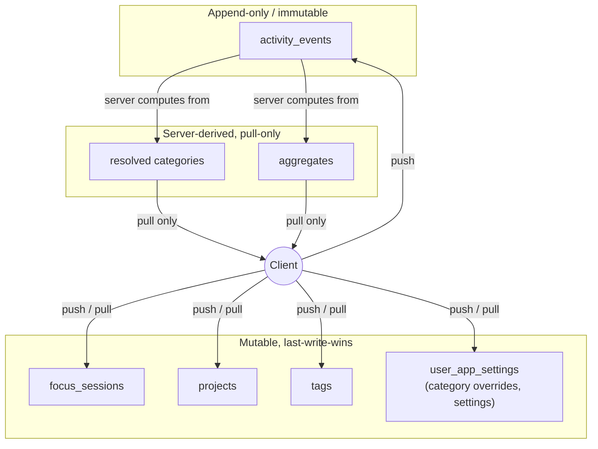
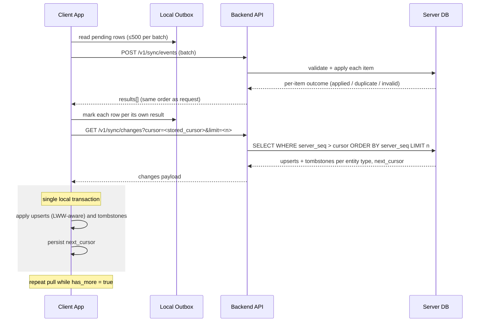

# Sync Protocol

## Overview

This document is the contract between the two clients ([[architecture-desktop]], [[architecture-mobile]]) and the backend ([[architecture-backend]]) for reconciling locally recorded activity with the shared, server-side dataset. It defines what each side is authoritative for, the two HTTP endpoints that carry data between them, the order of operations a client must follow, and the edge cases the protocol has to survive (clock skew, device restores, overlapping recordings, and duplicate device identifiers).

Everything below assumes the schema in [[database-schema]] and the authenticated transport described in [[api-reference]] and [[security]]. This document does not repeat endpoint authentication details beyond what's needed to read the schemas.

## Principles

The protocol rests on three rules that determine who is allowed to change what, and how conflicts are avoided rather than resolved after the fact:

1. **Clients are the source of truth for raw events.** Automatic activity capture (desktop app/window observation, iOS Screen Time summaries) and manually created records (focus sessions, projects, tags) originate on a client. The server never fabricates or edits the substance of a raw event; it only ingests what a client reports.
2. **The server is authoritative for derived data.** Category resolution and aggregates (daily/weekly rollups, cross-device totals) are computed exclusively by the backend from the raw events it has ingested. Clients read this derived data but never compute or push it themselves.
3. **Every client-created record is idempotent by construction.** Every record a client creates carries a client-generated **UUIDv7** — `event_id` for `activity_events`, `id` for every other client-owned entity. Because UUIDv7 is time-ordered and generated before the first network attempt, a client can retry a failed or ambiguous upload indefinitely without risk of creating duplicate rows: the identifier itself is the idempotency key.

These three rules are what let the sync protocol avoid a general-purpose conflict-resolution engine — raw data is append-and-deduplicate, derived data is pull-only, and only a narrow, well-defined class of mutable entities needs any conflict handling at all (see below).

## Entity Classes and Sync Strategies

Every entity synced between client and server falls into exactly one of three classes. The class determines whether the entity can conflict at all, and if so, how the conflict is resolved.

| Entity class | Entities | Strategy | Idempotency / conflict rule |
|---|---|---|---|
| Append-only, immutable | `activity_events` | Push-only from client; never mutated after ingestion. | Idempotency key is the composite `UNIQUE (user_id, event_id, started_at)` constraint defined in [[database-schema]]. Deletion is a tombstone (`deleted` flag set), never a hard delete through the sync path. No conflicts are possible — two pushes of the same key are the same fact reported twice. |
| Mutable, last-write-wins | `focus_sessions`, `projects`, `tags`, category overrides (`user_app_settings`), other settings | Push and pull; edited after creation. | Client supplies its own `updated_at`. Server compares it against the currently stored `updated_at` for that `id` (last-write-wins). Server rejects a client timestamp skewed more than 24 hours from server time and substitutes server time for that write (see [[#Clock Skew]]). Whichever timestamp wins, the server persists that version and bumps `server_seq` on the row. |
| Server-derived | Resolved categories, aggregates (daily/weekly rollups, cross-device totals) | Pull-only. | Never pushed by clients under any circumstance. Computed by the backend from ingested `activity_events` and the current category-override state. Exposed only through `GET /v1/sync/changes`. |



## Push — `POST /v1/sync/events`

Clients push their local outbox — rows created or tombstoned since the last successful push — in batches. A single request MUST NOT contain more than **500 items**; a client with a larger outbox splits it into sequential batches.

### Request schema

```json
{
  "device_id": "string, stable per install",
  "items": [
    {
      "entity_type": "activity_event",
      "data": {
        "event_id": "018f9a3e-2b4b-7c31-9a2e-6f1d2b3c4d5e",
        "started_at": "2026-07-05T14:32:00Z",
        "ended_at": "2026-07-05T14:47:00Z",
        "app_bundle_id": "com.apple.dt.Xcode",
        "window_title": "sync-protocol.md — Rize-Clone",
        "precision": "exact",
        "deleted": false
      }
    },
    {
      "entity_type": "focus_session",
      "data": {
        "id": "018f9a41-9d2a-7e3f-8b11-2f4a6c8d0e12",
        "updated_at": "2026-07-05T14:50:00Z",
        "started_at": "2026-07-05T14:30:00Z",
        "ended_at": "2026-07-05T14:50:00Z",
        "project_id": "018f99f0-6a11-77aa-9c40-1a2b3c4d5e6f",
        "kind": "focus",
        "status": "completed",
        "note": "Deep work",
        "deleted": false
      }
    },
    {
      "entity_type": "user_app_setting",
      "data": {
        "id": "018f9a44-11cd-7abf-9d02-aa11bb22cc33",
        "updated_at": "2026-07-05T14:51:10Z",
        "app_bundle_id": "com.tinyspeck.slackmacgap",
        "category_override": "Communication",
        "deleted": false
      }
    }
  ]
}
```

Field notes:

- `entity_type` is a discriminator; valid values are `activity_event`, `focus_session`, `project`, `tag`, `user_app_setting`, and any other mutable settings entity defined in [[database-schema]].
- `activity_event.data` never includes `deleted: true` on first creation; tombstoning an existing event is a subsequent push of the same `event_id` with `deleted: true` and the same `started_at` (per the immutability rule, no other field may change on a tombstone push).
- For mutable entities, `data.id` and `data.updated_at` are required on every item, including tombstones (`deleted: true` is itself just another LWW-compared write).
- `precision` (`exact` | `approximate`) is only meaningful on `activity_event` items; see [[#Precision Semantics]].

### Response schema

The response returns one result per submitted item, in the same order as the request, so partial success can be applied atomically per row rather than per batch:

```json
{
  "results": [
    { "index": 0, "entity_type": "activity_event", "event_id": "018f9a3e-2b4b-7c31-9a2e-6f1d2b3c4d5e", "status": "applied" },
    { "index": 1, "entity_type": "focus_session", "id": "018f9a41-9d2a-7e3f-8b11-2f4a6c8d0e12", "status": "applied", "server_seq": 48213 },
    { "index": 2, "entity_type": "user_app_setting", "id": "018f9a44-11cd-7abf-9d02-aa11bb22cc33", "status": "duplicate" },
    { "index": 3, "entity_type": "activity_event", "event_id": "018f9a47-0000-7000-8000-000000000000", "status": "invalid",
      "error": { "code": "VALIDATION_ERROR", "message": "ended_at precedes started_at" } }
  ]
}
```

Per-item `status` is exactly one of:

- **`applied`** — the item was persisted. For mutable entities this means the write was evaluated under last-write-wins and the response's `server_seq` reflects the row's new sequence number, whether or not this particular write ended up being the winning value (see [[#Entity Classes and Sync Strategies]]).
- **`duplicate`** — the item was already present under its idempotency key (`(user_id, event_id, started_at)` for `activity_events`; a not-newer `updated_at` for LWW entities) and was a no-op.
- **`invalid`** — the item was rejected outright (malformed payload, foreign-key violation, failed validation). The `error` object carries a machine-readable `code` and a human-readable `message`.

**Partial success is allowed.** A batch is never rejected as a whole because one item is invalid; the client marks each outbox row according to its own result — `applied` and `duplicate` rows are removed from the outbox, `invalid` rows are flagged for user-visible surfacing or discarded per client policy, and the rest of the batch is unaffected.

> [!note] Open question
> The brief does not specify whether the per-item response for a mutable entity signals that the server substituted its own timestamp for a skewed client `updated_at` (see [[#Clock Skew]]). As written, an `applied` result does not distinguish "your timestamp was accepted" from "your timestamp was replaced by server time." If clients need to detect this to warn users about a misconfigured clock, an additional field (e.g. `timestamp_adjusted: true`) would need to be added to the result object.

## Pull — `GET /v1/sync/changes?cursor=<opaque>&limit=<n>`

Clients pull changes — including server-derived data — using **keyset pagination** over a per-row `server_seq BIGINT` that is bumped on every write to a row, whether that write originated from a push or from server-side derivation (aggregate recomputation, category resolution).

- `cursor` is an opaque token representing the last `server_seq` the client has fully consumed. On a client's first-ever pull, `cursor` is omitted or empty, and the server starts from the beginning of that user's change stream.
- `limit` bounds the number of changed rows returned per entity type in a single response page.

### Response schema

```json
{
  "changes": {
    "activity_events": {
      "upserts": [
        {
          "event_id": "018f9a3e-2b4b-7c31-9a2e-6f1d2b3c4d5e",
          "started_at": "2026-07-05T14:32:00Z",
          "ended_at": "2026-07-05T14:47:00Z",
          "app_bundle_id": "com.apple.dt.Xcode",
          "category": "Development",
          "precision": "exact",
          "server_seq": 48210
        }
      ],
      "tombstones": [
        { "event_id": "018f99aa-1111-7222-8333-444455556666", "server_seq": 48211 }
      ]
    },
    "focus_sessions": { "upserts": [ /* ... */ ], "tombstones": [ /* ... */ ] },
    "projects": { "upserts": [ /* ... */ ], "tombstones": [ /* ... */ ] },
    "tags": { "upserts": [ /* ... */ ], "tombstones": [ /* ... */ ] },
    "user_app_settings": { "upserts": [ /* ... */ ], "tombstones": [ /* ... */ ] },
    "aggregates": {
      "upserts": [
        { "date": "2026-07-05", "category": "Development", "duration_seconds": 14400, "server_seq": 48215 }
      ],
      "tombstones": []
    }
  },
  "next_cursor": "opaque-cursor-string",
  "has_more": true
}
```

Every entity type the user has data for is represented as an `{ upserts, tombstones }` pair, even server-derived types like `aggregates`, since a recomputed aggregate is itself an upsert with a fresh `server_seq`. `next_cursor` is always returned; the client repeats the pull with `next_cursor` while `has_more` is `true`, and stops once a page comes back with `has_more: false`.

**Pulls are idempotent and safe to repeat.** Because the cursor is a strict keyset bound (`server_seq > cursor`) rather than a time window, requesting the same cursor twice returns the same page, and applying that page twice is a no-op (upserts overwrite by `id`/`event_id`, tombstones set `deleted` which is already set on replay). This is what makes cursor loss and full re-pull safe (see [[#Device Restore from Backup]]).

## Flow

A sync cycle always pushes before it pulls, and the client only advances its stored cursor after both the pull's data and the cursor itself are durably committed together.



The critical invariant is the transactional pairing at the end: **applying pulled changes and persisting the new cursor happen in the same local database transaction.** If the client crashes or loses power between applying data and saving the cursor, an all-or-nothing local transaction guarantees it either re-requests the same page (safe, per idempotent pulls) or has already durably recorded that it consumed it — it can never apply data and lose the cursor advance, which would otherwise cause the same page to be reapplied against a client state that has already moved past it in some other way.

> [!note] Permitted relaxation
> Clients MAY persist the pull cursor outside the apply transaction, but only if cursor persistence strictly follows a successful apply and pulls remain idempotent. The dangerous direction — advancing the cursor before (or without) the corresponding data being applied — must remain impossible; this relaxation only ever moves cursor persistence later relative to a completed apply, never earlier.

## Edge Cases

### Clock Skew

Mutable entities carry a client-supplied `updated_at` used for last-write-wins comparison. If a client's clock is skewed by more than 24 hours from server time, the server rejects the supplied timestamp for that write and substitutes its own server time before performing the LWW comparison and persisting the row. This bounds how far a misconfigured client clock can distort ordering across devices, at the cost of that one write being ordered by arrival time rather than the client's intended time.

### Device Restore from Backup

If a device is restored from a backup (a new install inherits an old, stale local database, including a stale sync cursor), the client simply resumes pulling from whatever cursor it has — including a cursor reset back to empty, which triggers a full re-pull of the user's change stream from the beginning. This is safe without any special-cased recovery logic specifically because pulls are idempotent: re-applying already-known upserts and tombstones has no effect beyond redundant local writes, and there is no risk of duplicating server-side state since pull is a read-only operation.

### Duplicate Device IDs

Two installations reporting the same `device_id` (for example, a device restored from another device's backup without regenerating its identifier) is a possible failure mode. Cross-user reuse is rejected at device registration by the schema itself; the same-user, two-installations case is tolerated by construction rather than detected or resolved server-side:

- **Cross-user reuse is rejected at registration, not merely tolerated.** The deployed `devices` table's primary key, `id`, is globally unique and is the same value the sync payload reports as `device_id` (see [[database-schema]]'s `devices` table). Each `id` row is bound to exactly one `user_id`, which is strictly stronger than the `UNIQUE (user_id, device_id)` semantics the sync protocol requires as its contract minimum — so two different users can never register the same device id in the first place; there is no cross-user collision case left for the server to tolerate after registration. Device ids are client-generated UUIDs, which makes even the attempt at a cross-user collision practically impossible; and even in the astronomically improbable event of a UUID collision, every row in every syncable table is tenant-scoped by `user_id`, so no data could mix regardless.
- **The same-user, two-installations case (backup restore) is tolerated, not detected.** If the same user ends up with two live installations sharing one `device_id` — the backup-restore scenario — the server does not detect the collision or force a client-side identifier regeneration. This is safe because idempotency and conflict resolution are keyed on `event_id` (for `activity_events`), `id` (for other client-owned entities), and `updated_at` (for last-write-wins comparisons) — never on `device_id`. Every push and pull continues to resolve correctly under [[#Entity Classes and Sync Strategies]] regardless of how many installs share a `device_id`. The only degradation is blurred per-device attribution: reports and any future per-device breakdowns cannot fully distinguish activity from the two installations.
- **Prevention is client-side, not server-side.** Clients must store their `device_id` in Keychain with `ThisDeviceOnly` accessibility, so the identifier is excluded from device backups and never migrates to a restored installation. This is the intended mitigation for the backup-restore case; there is no server-side collision detection or forced regeneration mechanism. The mobile client currently stores the device id with `AfterFirstUnlock` accessibility; hardening it to `ThisDeviceOnly` is tracked as RIZ-50.

### Overlap Rules

`activity_events` from the same device can legitimately overlap in wall-clock time only as a data-quality artifact (for example, a tracking bug or a monitor restart producing a slightly re-drawn interval). This overlap is **not trimmed at ingestion**: trimming a raw event's boundaries at push time would mean the server editing the substance of a raw event, which violates [[#Principles|Principle 1]] and the append-only/immutable handling required for the `activity_events` class in [[#Entity Classes and Sync Strategies]]. Same-device overlapping intervals are therefore ingested exactly as reported, with no adjustment.

Instead, trimming happens at report/aggregation time, not at ingestion. [[architecture-backend]]'s Aggregation Strategy owns the mechanism for capping same-device overlap and disambiguating cross-device overlap, so the requirement is stated here and the mechanism is documented in one place only — see that section for how a single device's contribution to a window is bounded.

Overlapping events from **different** devices are allowed to stand as reported and are not trimmed against each other — a user genuinely can have simultaneous desktop and mobile activity — and are disambiguated at report time by the same [[architecture-backend]] mechanism, rather than at ingestion time.

## Precision Semantics

`activity_events` carry a `precision` field with two possible values:

- **`exact`** — the event's `started_at`/`ended_at` boundaries reflect directly observed activity (for example, desktop's continuous app/window observation).
- **`approximate`** — the event was derived from an iOS `DeviceActivityMonitor` threshold callback rather than continuous observation; see [[architecture-mobile]] for how the Monitor extension produces these. Threshold-derived events only tell the client that some amount of usage crossed a configured boundary within an interval, not the precise start/stop instant, so they are marked `approximate` rather than `exact`.

Report queries against the backend can filter by precision — including or excluding `approximate` events — so that a report can be scoped to strictly-observed time only, or can include the coarser iOS-derived signal when a fuller (if less precise) picture of a user's activity is wanted.

## Related

- [[system-overview]]
- [[architecture-desktop]]
- [[architecture-mobile]]
- [[architecture-backend]]
- [[api-reference]]
- [[database-schema]]
- [[security]]
