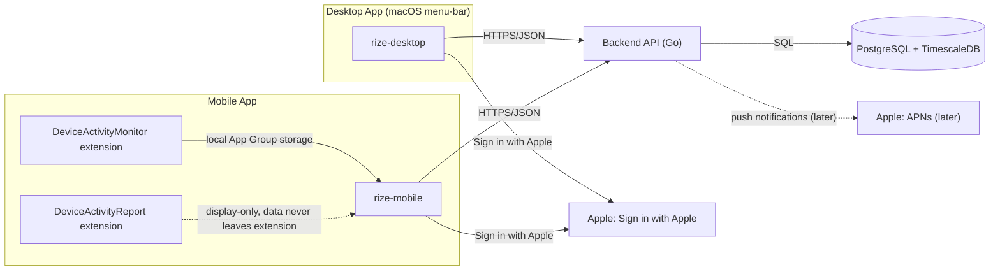

# System Overview

## Product Summary and Core User Flows

Rize-Clone tracks how users spend time on their devices and turns that activity into reports the user can act on. The product spans two clients and one backend:

- **Automatic time tracking on Mac**, at the application and window level. The desktop app observes the frontmost application and window title in the background, without requiring the user to start or stop anything.
- **Glanceable stats on iOS.** Because iOS does not allow the same class of automatic, always-on tracking as macOS, the mobile app surfaces summarized activity through Apple's on-device Screen Time frameworks rather than raw automatic capture.
- **Manual timers and focus sessions on both platforms.** Users can explicitly start a timer for a task or enter a focus session; this is the mechanism by which mobile activity becomes attributable to specific work, complementing the coarser automatic signal.
- **Unified cross-device reports served by the backend.** Activity recorded on desktop and mobile is uploaded to a common backend, which aggregates it and serves reports that combine both sources into one view of the user's time.

These flows are implemented across three codebases described in [[architecture-desktop]], [[architecture-mobile]], and [[architecture-backend]], and synchronized using the contract defined in [[sync-protocol]] and [[api-reference]].

## System Context Diagram

The diagram below shows the system at C4-context level: the two client apps (including the mobile app's two Screen Time extensions), the backend API, its datastore, and the external Apple services the system depends on.

Notes on the arrows:

- Desktop and mobile clients both talk to the backend exclusively over **HTTPS/JSON**, per [[api-reference]].
- The **DeviceActivityMonitor extension** hands activity data to the mobile app through **local App Group storage** — an on-device, shared-container handoff, not a network call.
- The **DeviceActivityReport extension** is display-only: it renders Screen Time data inside Apple's sandboxed rendering surface, and that data never leaves the extension (it is not written to the App Group and never reaches the backend).
- Sign in with Apple is used by both clients for authentication. APNs is listed as a later addition for push notifications and is not part of the current data path.

> [!note] Open question
> The brief does not specify whether APNs push notifications originate from the backend for both platforms or are scoped to one client. Marked as "later" and out of scope for the current sync contract in [[sync-protocol]].

## Tech Stack per Project

### Desktop (rize-desktop)

| Choice | Justification | Alternatives considered |
|---|---|---|
| Swift 5.10+ with SwiftUI (UI) | Native language/toolchain for macOS with modern declarative UI for the app's windows and views. | — |
| AppKit for the `NSStatusItem` menu-bar shell | SwiftUI's `MenuBarExtra` is too limited for the menu-bar shell the app needs; `NSStatusItem` gives full control over the menu-bar item. | SwiftUI `MenuBarExtra` |
| Native tracking APIs: `NSWorkspace` (frontmost app notifications), `CGWindowList` + Accessibility API (window titles), `CGEventSource`/IOKit (idle detection) | Automatic tracking is impossible in Electron or a web-based shell without shelling out to native code anyway, so the app is built natively from the start to access these OS-level signals directly. | Electron/web shell with native helper process |
| SQLite via GRDB for the offline-first store | GRDB is mature, supports migrations, and works with value-type records, which fits an offline-first local store that must survive schema evolution. | — |
| Distribution: Developer ID + notarization, not the Mac App Store | The Accessibility API (required for window titles) is incompatible with the App Sandbox that Mac App Store distribution requires. | Mac App Store distribution |

See [[architecture-desktop]] for how these pieces fit together.

### Mobile (rize-mobile)

| Choice | Justification | Alternatives considered |
|---|---|---|
| Swift/SwiftUI | Native language/toolchain for iOS UI. | — |
| DeviceActivity + FamilyControls + ManagedSettings frameworks | These are Apple's sanctioned frameworks for observing and reporting on-device activity under Screen Time privacy constraints. | — |
| App Group for extension-to-app data handoff | Provides the shared, on-device storage mechanism the Monitor extension uses to hand activity data to the main app (see system context diagram above). | — |
| GRDB or SwiftData for the local store | Local persistence for activity and session data on-device. | — |
| Hybrid tracking model (automatic Screen Time summaries + manual timers/focus sessions) | Apple's privacy constraints make full automatic tracking, of the kind available on macOS, impossible on iOS; the hybrid model combines what DeviceActivity can report automatically with explicit manual timers/focus sessions for attribution. | Full automatic tracking (not permitted by platform) |

Full rationale and extension architecture are covered in [[architecture-mobile]].

### Backend (rize-backend)

| Choice | Justification | Alternatives considered |
|---|---|---|
| Go (single static binary) | Strong concurrency support for ingestion workloads and low operational cost of a single static binary deployment. | — |
| Chi router | stdlib-compatible, has a good middleware ecosystem, and avoids framework lock-in. | — |
| PostgreSQL + TimescaleDB | Activity events are append-heavy time-series data; hypertables, continuous aggregates, compression, and retention policies replace the need for a separate OLAP store. | Separate OLAP store alongside plain PostgreSQL |
| sqlc/pgx for data access | Typed, generated data access layer over PostgreSQL. | — |
| golang-migrate for migrations | Schema migration tooling for the Go backend. | — |
| golang-jwt for JWT | JWT issuance/validation for authenticated API access. | — |

Schema and query details live in [[database-schema]]; endpoint contracts live in [[api-reference]]; authentication and token handling are covered in [[security]]. Architecture detail is in [[architecture-backend]].

## Key Architectural Decisions

The following mini-ADRs capture the decisions that shape how the three codebases interact. Full mechanics of syncing are in [[sync-protocol]].

- **Offline-first clients.** Both desktop and mobile clients record activity and manage sessions locally first, independent of network connectivity, and sync to the backend when possible. Rationale: tracking must not be interrupted or lost by transient connectivity loss, since activity capture happens continuously in the background.

- **Server-authoritative aggregation.** The backend is the source of truth for cross-device aggregation and reporting; clients do not merge or reconcile each other's data locally. Rationale: unified cross-device reports require a single place where all clients' data converges, which only the backend can provide.

- **Client-generated UUIDv7 identifiers for idempotency.** Records created on a client carry a UUIDv7 identifier generated on the client, used by the backend to deduplicate retried or replayed uploads. Rationale: offline-first clients may retry uploads after connectivity gaps, and UUIDv7's time-ordered structure supports idempotent ingestion while remaining sortable.

- **Last-write-wins (LWW) for mutable entities.** Entities that can be edited after creation (for example, manual timer or focus session metadata) are reconciled using last-write-wins semantics when the same entity is modified on multiple clients. Rationale: LWW is a simple, low-coordination conflict resolution strategy appropriate for entities where losing a rare concurrent edit is an acceptable tradeoff against sync complexity.

- **Append-only, immutable activity events.** Raw activity events (automatic app/window activity, Screen Time reports) are never mutated after ingestion; corrections are made by appending new events, not editing existing ones. Rationale: this matches the append-heavy time-series nature of the data (see the TimescaleDB choice above) and keeps the ingestion path simple and auditable.

> [!note] Open question
> The brief does not specify how LWW conflicts are detected (e.g., via updated-at timestamps versus vector clocks) or which fields on mutable entities participate in the comparison. See [[sync-protocol]] for where this should be formalized.

## Repos and Structure

The codebase is organized as a master repository, `Rize-Clone`, with three git submodules:

- `rize-desktop` — the macOS menu-bar app, see [[architecture-desktop]]
- `rize-mobile` — the iOS app plus its two Screen Time extensions, see [[architecture-mobile]]
- `rize-backend` — the Go API and data layer, see [[architecture-backend]]

Each submodule maintains its own README and CLAUDE.md describing its internal purpose and structure. The `documentation/` directory in the master repo is the source of truth for cross-repo contracts — the sync protocol, the API surface, the database schema, and security requirements — so that changes to any one client or the backend can be checked against a single shared specification rather than against another codebase's implementation.

## Related

- [[architecture-desktop]]
- [[architecture-mobile]]
- [[architecture-backend]]
- [[sync-protocol]]
- [[api-reference]]
- [[database-schema]]
- [[security]]
